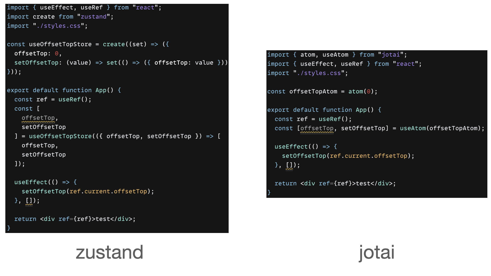
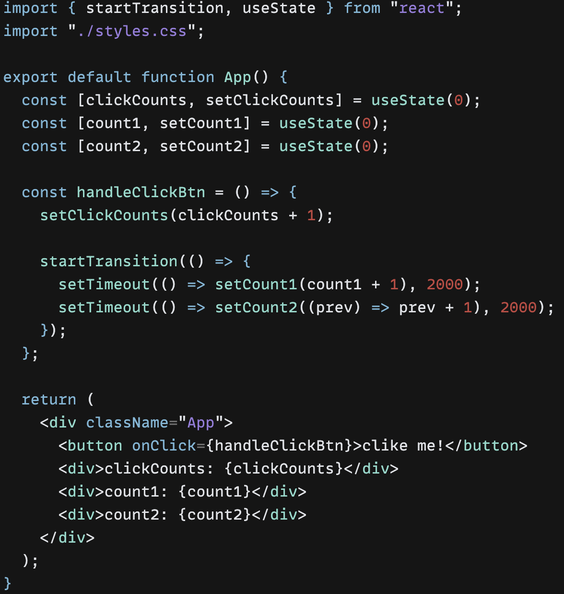
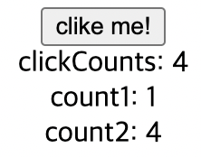

## 📌 CRUD, Business Logic, Business Rule

CRUD는 애플리케이션이 할수 있는 Create, Read, Update, Delete 작업을 의미하고, Business Logic은 Business Rule을 코드로 옮긴 것 입니다. Business Rule은 애플리케이션이 어떻게 동작해야 하는지를 정의하고, CRUD에 대한 제약을 만들어냅니다.

Bug Tracker 애플리케이션은 버그를 Create, Read, Update, Delete한다는 점에서 CRUD 앱으로 해석될 수 있지만, 실제 내부에서는 단순한 CRUD가 발생하지 않습니다.

- 개발자는 특정 버그에 대해서 verified된 것인지 closed된 것인지를 표시할 수 없습니다. 오직 QA 소속만이 할수 있습니다.
- 프로젝트 매니저는 버그를 delete할 수 없습니다.
- 버그에 '테스트 예정'이라는 마킹을 남기기 위해서는 해당 버그에 대해서 적어도 하나의 commit이 남아있어야 합니다.
- closed된 버그만이 reopen 상태로 바뀔 수 있습니다.
- 개발자와 QA 소속 인원만이 프로젝트에 존재하는 버그를 확인할 수 있습니다.

위에 적어놓은 항목들이 Busienss Rule들입니다.

카카오톡 채팅방으로 따진다면 방장만이 사람들을 강퇴할 수 있음, 메세지를 삭제할 수 있음, 확성기를 쓸수 있음등에 대한 제약들이 Business Rule에 해당하지 않을까 싶다.

**[What really is the "business logic"?](https://softwareengineering.stackexchange.com/questions/234251/what-really-is-the-business-logic)**

---

## 📌 zustand와 jotai

zustand에서 jotai로 변경했다. 다른 특성들을 다 차치하고, boilerplate 코드가 적어져서 너무 편하다. zustand에서는 setter 함수(tslint 설정에 따라 다르겠지만 우리 팀에서는 setter 함수에 대한 타입까지 선언해줘야 했다.) 를 항상 적어줬는데, jotai에서는 그럴 필요가 없다.

---

## 📌 react 18이 outdated한 transient update 제거하는 특성

오픈소스 컨트리뷰션에서 만난 팀원들에게 react 18 shallow dive라는 이름으로 react 18버전에 대해서 발표를 했다. 발표하면서 멘토님으로부터 다음과 같은 질문을 받았다.

> 버튼을 클릭해서 counter의 숫자를 올린다고 할때, outdated한 transient update는 제거되니까 counter 계산이 건너뛰어질 수 있나요?

생각하지도 못했던 질문이었다. ㅇㅅaㅇ;;; 그래서 테스트를 위해서 다음과 같이 코드를 작성했다.

버튼을 연속으로 네번 누르면 결과가 어떻게 나올까?

;

callback 함수로 업데이트하는 경우에는 사용자의 빠른 인터랙션이 어떤 연산과정과 얽히는 경우 이전 계산은 날라가버려서 숫자 1이 찍히는 것을 알수있다 (뭐 당연한 것 같기도 하고 -_-). 다만 callback 함수를 통해서 업데이트하는 경우, 어찌됐건 이전 계산 결과를 바탕으로 연산을 진행하기 때문에 숫자 4가 찍히는 것을 알수있다.

---

## 📌 jotai와 provider-less mode

jotai의 경우 provider mode와 provider-less 모드가 존재한다. app 컴포넌트를 provider로 감싸면 provider 모드고 감싸지 않으면 provider-less 모드가 되는데, provider를 사용할 때 발생하는 이점은 다음과 같다.

1. 디버깅의 목적

    provider-less 모드에서는 디버깅시 리액트 컴포넌트 트리 전체에 대한 atom을 보여주지만, 만약 특정 subtree를 provider로 감싸면, 해당 provider에 존재하는 atom들만 디버깅이 가능하다고 한다. ([링크](https://jotai.org/docs/guides/debugging#use-atoms-debug-value))

2. SSR시에 특정 atom이 초기값을 갖게하기

    2번의 대안으로 useHydrateAtoms를 이용하는 방법도 존재하는데, Provider를 이용하는 것에 비해서 훨씬 더 깔끔하다.

공식 문서에서는 SSR 사용시에 Provider를 감싸주어야 한다고 한다. 이유는 앱이 여러 개의 instance를 가질 수 있기 때문에, Provider를 제공함으로써 각각의 인스턴스가 각각의 상태를 가짐으로써 default store에 이전에 존재하던 값이 영향받지 않도록 하기 위함이라고 한다. [공식문서](https://jotai.org/docs/guides/nextjs#provider), [github issue](https://github.com/pmndrs/jotai/issues/1190#issuecomment-1145878168)

잘 이해가 되지 않는다. 🤯

--- 

## 📌 next/image가 해결해주는 것

1. 부적절한 이미지 사이즈

   무엇을 설정해야 next/image가 이 부분을 커버할 수 있는지 아직 이해하지 못했다. 주요 키워드로 sizes / srcset / deviceSizes / ImageSizes가 있는 듯 하다.

2. 이미지 형식

   브라우저가 WebP 형식을 지원한다면, jpg, png 파일은 자동으로 WebP 포맷으로 변환된다. 실제로 네트워크창을 열어보면 jpg 이미지 형식을 webp으로 불러오는 것을 확인할 수 있다.

3. 너무 빠른 로드

    next/image는 기본적으로 lazy-loading한다

4. 로드 우선 순위

    priority 프로퍼티 설정을 통해서 LCP 개선을 이끌어낼 수 있다.
    priority 관련한 내용은 아래에 별도로 기술해놓았다.

5. CLS (Culmulative Layout Shift)

    placeholder를 통해서 CLS를 방지한다. placeholder는 빈 영역 또는 blur 이미지(로컬 이미지의 경우 build 타임에 base64로 인코딩한 blur 이미지 자동 생성, 리모트 이미지의 경우, build 타임에 이미지 파일 접근이 불가능하므로 base64로 인코딩된 data url 지정 필요)를 적용한다. 또한 리모트 이미지에 대해서 width와 height을 요구하는 것 역시도 CLS를 방지하기 위함이다. (layout이 fill로 적용되는 경우, width와 height을 기입하지 않아도 되는데, 그 이유는 부모의 width와 height을 따라가기 때문이다)
   
참고로 로컬 이미지의 경우(static import), build 타임에 width, height 계산 및 base64인코딩 후 blur 이미지 처리까지 되지만, 리모트 이미지의 경우(dynamic image), build 타임에 이미지 접근이 불가능하므로, width, height 기입 및 blur 이미지의 경우, base64로 인코딩된 data url을 지정해줘야 한다.

위 내용은 [An Overview: Next.js Image Component And Its Powerful Capabilities](https://www.axelerant.com/blog/overview-nextjs-image-component-and-its-powerful-capabilities)와 [Next/Image를 활용한 이미지 최적화](https://fe-developers.kakaoent.com/2022/220714-next-image/)를 참고했다.

---

## 📌 dynamic import vs static import

nextjs를 읽다보면 static import와 dynamic image에 관한 이야기가 나오는데, dynamic image는 리모트의 이미지를 가져오는 것이고, static import는 로컬 이미지를 가져오는 것을 의미하는 듯 하다. [링크](https://nextjs.org/docs/api-reference/next/legacy/image#placeholder)

---

## 📌 Image 컴포넌트 priority 프로퍼티

LCP(Largest Contentful Paint) 요소가 되는 이미지에는 priority 프로퍼티를 추가해야한다. priorty 프로퍼티 통해서 높은 우선순위와 함께 preload 된다. 스크롤 없이(above the fold, 아무런 행동을 하지 않은 기본 화면) 보여지는 이미지에만 priorty 프로퍼티를 적용해야한다. [nextjs 공식문서](https://nextjs.org/docs/basic-features/image-optimization#priority)
