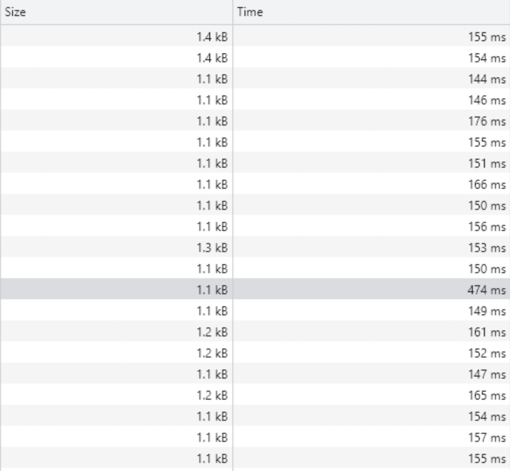
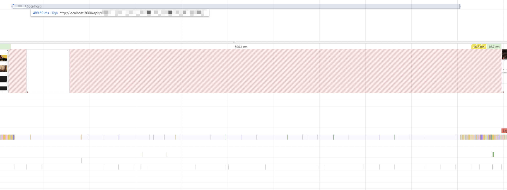
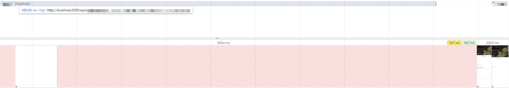

## 📌 웹뷰 개발은 이번 생에 처음이라 😞

Google Store에 1.0.0 버전을 12월 말에 배포하고, 1.0.1을 준비하던 중 문제에 부딪혔다. 나는 1.0.1 버전에서 권한 승인 기능과 관련한 고도화 작업을 진행했는데, 1.0.0 버전에 대한 고려를 미쳐하지 못했다. react 코드만 바뀌면 상관이 없는데 react-native 코드도 바뀌어서, 기존에 1.0.0 버전의 react-native 코드가 적용된 앱은 사용이 불가능해진 것.

쉽게말하면 react를 1.0.1 버전으로 업그레이드 하면 기존의 앱과 새롭게 배포될 앱 모두 react 1.0.1 버전이 적용되는데, 기존 앱의 경우 react-native 버전이 1.0.0이고, 신규 앱의 경우 react-native 버전이 1.0.1인 상황에서 react 1.0.1버전은 react-native 1.0.1에 의존하기 때문에 기존 사용자는 앱이 켜지지 않는 문제가 발생했다.

절대 발생하면 안되는 문제를 발생시켰지만, 너무나도 귀중한 경험을 한것 같다.

---

## 📌 페이지 전환간 하얀 화면 잡기

글 상세 페이지에 접속할 때 하얀 화면이 오래 보이는 문제가 존재했다. 아무래도 API 요청같아서 여러 페이지를 들락날락하며 타이밍을 까보니

위와 같이 한번씩 튀는 요청이 존재한다. 좀더 디테일한 정보를 보기 위해서 타이밍 브레이크 다운을 살펴보니

initial conneciton이나 waiting for server response에서 시간이 오래 걸리는 것을 확인했다. waiting for server response가 뭔지는 알겠고, [initial connection](https://developer.chrome.com/docs/devtools/network/reference/?utm_source=devtools#timing-explanation)은 무엇인가 살펴보니 TCP 핸드 쉐이크나 SSL 협상 시간이라고 한다.

정말 네트워크 문제일까? 내가 작성한 코드에서 문제가 되는 부분이 존재하지 않을까 고민하다가 Performance 탭을 돌려보니 네트워크 요청 문제가 확실해졌다.

FE에서 해줄 수 있는 것은 아래 이미지처럼 컨텐츠를 다운로드한 후에 Task를 최소화 해주는 것밖에 없었다. 로직적으로 무거운 부분은 보이지 않고 가장 만만한 "화면에 안보이는 것"에 대한 로딩 비용을 줄여줄만한 부분부터 검토해보니, 화면에 바로 보이지 않는 "추천 게시글들"에 대한 컴포넌트가 하나 존재해서 이 부분을 Code Spliting 시켜줬다.

그러고 다시 네트워크 요청탭을 다시 까보니...

이전에 발생했던 initial connection과 waiting for server response가 발생하지 않는다. 원래 다섯번의 요청중 한번은 시간이 오래걸리는 요청이 존재해야 하는데, 나타나질 않았다.

실제로 Performance 탭을 보아도 글 상세 페이지 요청(첫번째 모자이크)이 끝나고 추천 게시글들에 대한 요청(두번째 모자이크)이 발생하는 것을 아래와 같이 확인할 수 있는데(코드상으로도 글 상세 페이지 요청에 대한 응답이 오지 않는 경우 return <></>이 실행되기 때문에 추천 게시글들에 대한 요청은 발생하지 않는데 대체 뭘까)

원인을 잘 모르겠다. 추측으로는 HTTP 커넥션이 병렬로 여러개 만들어져서 그럴수도 있지 않을까 정도...
