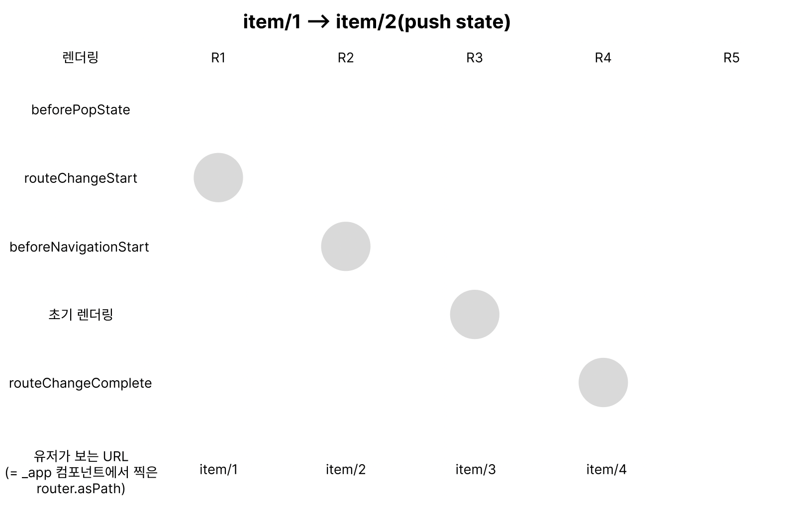
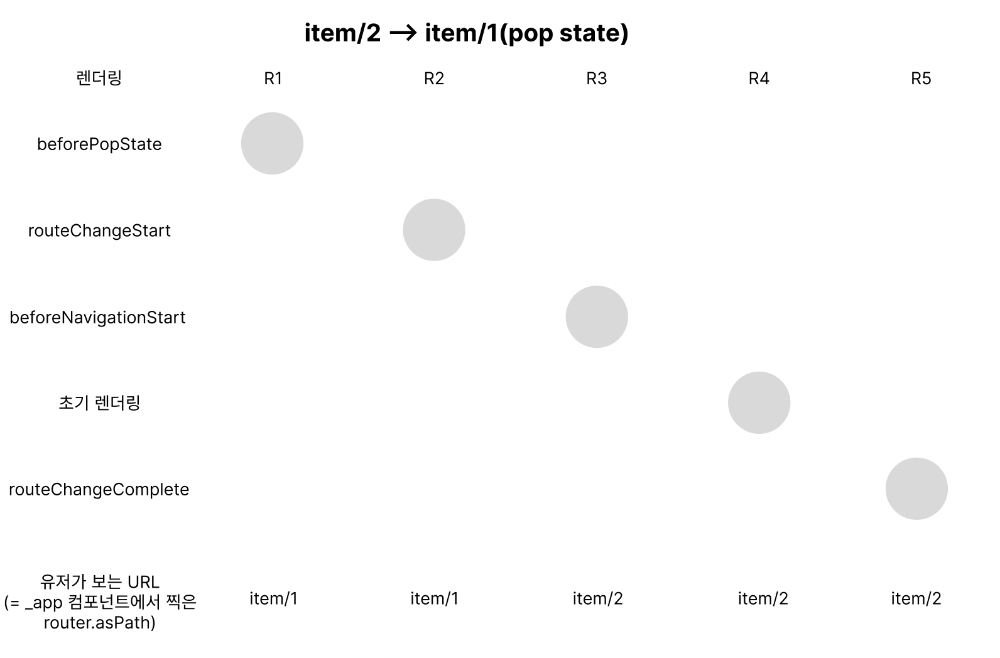
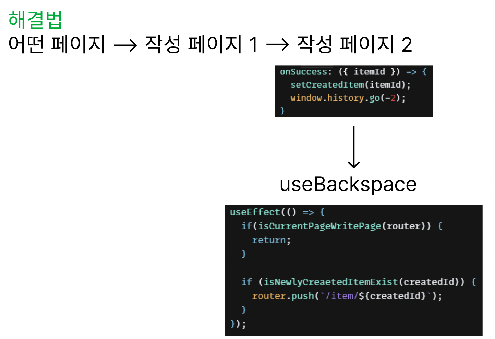

웹뷰 프로젝트를 진행하면서, dynamic routing 페이지에서 뒤로가기를 구현하면서 겪은 시행착오와 문제점들을 해결한 과정을 공유합니다.

목차는 다음과 같습니다.

#### 1. file based routing과 dynamic routing에 관한 이해

#### 2. dynamic routing 페이지의 특성

#### 3. 용어 정의

#### 4. nextjs에서 제공되는 route와 관련한 라이프 사이클 메서드들의 실행과 렌더링 및 페이지 URL 변화

#### 5. 코드 레벨에서의 뒤로가기 구현

- 스크롤 저장

- 스크롤 복원

- 어떤 글을 작성을 완료하고 뒤로가기 했을 때 글 작성 페이지로 돌아가지 않게 하는 방법

---

### 1. file based routing과 dynamic routing이란?

nextjs는 file based routing이며 dynamic routing 기능을 제공합니다. file based routing이라 함은 nextjs에서 고유하게 제공하는 pages 폴더 하위에 존재하는 폴더 및 파일들이 URL로 인식됨을 의미합니다.

가령 아래와 같은 폴더 구조가 있다고 가정합니다.

```
pages
  ㄴ item
      ㄴ list.tsx
      ㄴ [id].tsx

```

위와 같은 폴더 구조로 페이지가 구성된 경우 https://example.com/item/list으로 접근이 가능하고, 파일명에 대괄호가 들어가 있는 것을 통해서 dynamic routing 처리가 되어있는 것을 알 수 있습니다. 그러므로 https://exmaple.com/item/1 혹은 http://example.com/item/23 등, item 하위 경로의 아무 숫자로든 접근이 가능해집니다.

---

### 2. dynamic routing 페이지의 특성

dynamic routing 페이지의 특성 중 하나는, 페이지 내에 존재하는 버튼 요소등을 통해서 동일한 dynamic routing 경로에 접근하는 경우, 그러니까 item/1 -> item/2 -> item/3 -> ... -> item/100 과 같이 이동하는 경우, [id].tsx 컴포넌트는 [unmount되지 않고 계속 사용](https://nextjs.org/docs/api-reference/next/router#resetting-state-after-navigation)됩니다. 다만, 리렌더링이 계속 발생할 뿐입니다.

이로부터 파생되는 다음 두가지 특성이 존재합니다.

#### 1. 이전 상태가 계속 유지됩니다.

item/1에서 머무르다가 item/2에 도달했을 때 값을 초기화한 상태에서 시작하는게 아니라, item/1에 사용하던 상태와 컴포넌트가 그대로 남아있습니다. 그리고 다음과 같은 문제를 야기합니다.

a. 서로 다른 item 페이지에 방문할 때마다, useEffect 내부에서 어떤 로직이 실행되길 기대한다면, 페이지의 변화를 알수있게 dependency 로직에 넣어주어야 합니다.

b. item/1이 item/2에 비해서 스토리 컨텐츠의 스크롤 가능 높이가 매우 크다고 가정할 때, item/2에서 item/1로 뒤로가기 하는 경우, 렌더링하는 과정과 스크롤을 복원하려는 로직의 충돌(?)로 인해 스크롤이 정상적인 위치로 복원되지 않습니다.

#### 2. 화면을 아얘 처음부터 그리지 않기 때문에 화면이 깜빡이지 않습니다.

만약 이러한 특성을 원하지 않는다면, Component에 다음과 같이 key를 할당하여 remount 시켜줄 수 있습니다.

```javascript
// pages/_app.js
import { useRouter } from 'next/router'
import { getItem } from 'apis'

const ItemPage = () => {
  const { query } = useRouter()
  const id = +query.id
  const { data, isLoading, error } = useQuery(['item', id], getItem)

  if (isLoading || error) {
    return <></>
  }

  return <Item key={id} />
}
```

---

### 3. 용어 정의

페이지 네비게이션이 일어날 수 있는 방법과 용어에 대해서 몇가지 정의하고 넘어가겠습니다.

- 뒤로가기 (backspace, 주소탭 옆의 뒤로가기 클릭)

- 앞으로가기 (forward, 주소탭 옆의 앞으로가기 클릭)

- 페이지 내에서 다음 페이지로 넘어가는 요소와의 상호작용 (push 혹은 pushState)

- 주소탭에 URL 직접 입력

저는 여기서 뒤로가기에 대한 상황만 처리했을 뿐 나머지 상황은 처리하지 못했습니다.

---

### 4. nextjs에서 제공되는 route와 관련한 이벤트들의 실행과 렌더링 및 페이지 URL 변화

다음 코드에 보이는 이벤트 핸들러가 작성된 상태에서 URL이 이동될 때, 렌더링 순서와 페이지 URL이 어떻게 변하는지 알아봅시다. 아래 코드는 [Codesandbox](https://codesandbox.io/s/naughty-aj-mihsvq?file=/pages/_app.js)에 작성해두었습니다.

앞선 route 관련 이벤트들의 실행에 따른 렌더링 및 페이지 URL 변화를 시각화하면 다음과 같습니다.



먼저 push state 상황이므로 beforePopState 이벤트 핸들러는 실행되지 않습니다. 처음 렌더링(R1)은 routeChangeStart 이벤트 핸들러 내부의 상태 업데이트에 의해서 발생하고, 두번째 렌더링(R2)는 beforeNavigationStart 이벤트 핸들러에 의해 발생되고, 렌더링이 끝나면 URL이 바뀝니다.

URL이 바뀐직후 곧바로 초기 렌더링이 한번 일어나고(이때 새로운 id item/2로 데이터 요청), 초기 렌더링이 끝나면 routeChangeComplete에 의해서 네번째 렌더링(R4)가 발생합니다. 그러니까 만약 rotueChangeStart 이벤트 핸들러나 beforeNavigationStart 이벤트 핸들러에서 여러 상태를 업데이트하면 다음 페이지로 넘어가기 전에 모든 상태를 업데이트하고 다음 페이지로 넘어가게 됩니다.

routeChangeStart시 isRouting을 true로 만들고, routeChangeComplete시 isRouting을 false로 만듭니다. console.log(유저가 보는 현재 URL, isRouting)을 로깅하면 item/2, false가 찍히는 경우가 있을텐데, 초기렌더링이 존재함을 알지 못한다면 '라우팅도 안끝났는데 왜 URL은 바뀌어있지?'라는 생각이 들수 있습니다.

그도 그럴것이 chatGPT는 'route가 끝나면 유저가 사용 가능한 페이지가 보여져있다.'라고 설명하기에 착각할수 있습니다. (틀린 설명은 아닌...)

아래 뒤로가기 상황은 beforePopState만 추가되고 모두 동일합니다.



참고로 **beforePopState는 뒤로가기(back)뿐만 아니라 앞으로가기(forward)시에도 트리거**됩니다.

---

### 3. 현재 뒤로가기와 관련한 라이프 사이클 상태 변수(메서드가 아님)로 다음 세가지가 존재합니다.

- isBeforePopStateEventTriggered

- isCurrentPageVisitedByBackspace

우선 isBeforePopStateEventTriggered isCurrentPageVisitedByBackspace가 왜 사용되는지 설명하겠습니다.


beforePopState 이벤트 핸들러가 실행된 후 routeChangeStart 이벤트 핸들러 순서로 실행됩니다. 뒤로가기가 발생했는지, 안 발생했는지를 알기 위해서는 beforePopState가 실행됐는지 안 실행됐는지를 알수 있는 변수가 필요합니다. 그래서 isBeforePopStateEventTriggered 변수와 업데이트 함수를 만들었습니다.

```javascript
export let isBeforePopStateTriggered = false

export let updateIsBeforePopStateTriggered = (newValue: Boolean) =>
  (isBeforePopStateTriggered = newValue)
```

뒤로가기로직은 많은 페이지에서 사용될 것으로 예상됩니다. 그렇기 때문에 앱이 꺼지기 전까지 unmount되지 않는 \_app 컴포넌트 내에 useBackSpace()훅을 호출하여 이벤트 리스너를 등록하는데요. 뒤에서 설명하겠지만 실제 사용하는 페이지에서(현재는 스크롤 복원이 필요한 페이지) isBeforePopStateTriggered 변수가 필요하기 때문에 export 해주었습니다.


react가 관리하는 상태와 햇갈릴 수 있을 것 같아서 set이라는 prefix 대신 update prefix를 붙여주었습니다.

isBeforePopStateEventTriggered의 초기값을 항상 false로 만들고, beforePopState 이벤트 핸들러가 실행되면 true로 만듭니다. 그러면 routeChangeStart가 실행됐을 때 이 값이 true라면 뒤로가기가 발생한 상황이고, 그렇지 않다면 뒤로가기가 발생하지 않은 상태가 되게 됩니다.

그리고 isBeforePopStateEventTriggered는 routeChangeStart 이벤트 핸들러 내에서만 사용이 되는데, 만약 isBeforePopStateEventTriggered가 true라면 isCurrentPageVisitedByBackspace는 true가 되고 아니라면 false가 되게 됩니다.

#### 1. 스크롤 저장

스크롤 저장은 (1) push state시 혹은 (2) history stack상 맨 마지막에 존재하는 페이지에서 뒤로가기시(앞으로가기가 불가능한 페이지)에서 스크롤을 저장해야 합니다. (2)를 고려하지 않는다면, 뒤로가기 했다가 다시 앞으로가기시에 저장된 스크롤 위치가 없어서 정상적인 스크롤 복구가 이루어지지 않습니다.

저는 앞으로가기가 있는 웹의 조건이 아닌 앱의 조건을 우선적으로 구현하였으므로 둘다 처리하는 로직은 주석처리했습니다.

```javascript
const handleChangeRouteStart = () => {
  // (1)과 (2)처리
  // if (isBeforePopStateEventTriggered && isCurrentPageVisitedByBackspace) {
  //   return
  // }

  // (2) 처리
  if (isBeforePopStateEventTriggered) {
    return
  }

  if (scrollElementRef.current) {
    setScrollPosition([
      ...prevScrollPosition,
      {
        id,
        scroll: scrollElementRef.current.scrollTop,
      },
    ])
  }
}

events.on('routeChangeStart', handleChangeRouteStart)
```

보시다시피 스크롤 저장은 routeChangeStart 이벤트 핸들러 내에서 발생하게 되는데, isBeforePopStateEventTriggered를 통해서 뒤로가기가 발생했는지 발생하지 않았는지 여부를 판단할 수 있습니다. 발생하지 않았다면 앞으로

#### 2. 스크롤 복구

스크롤 복구는 뒤로가기가 발생했을 때만 트리거돼야 isCurrentPageVisitedByBackspace를 이용하여 작성해줍니다.

```javascript
useEffect(() => {
  if (isCurrentPageVisitedByBackspace) {
    const { scroll } = scrollPositions.pop()
    setScrollPositions(scrollPositions)
    scrollElementRef.current.scrollTo(scroll)
  }
}, [isCurrentPageVisitedByBackspace])
```

#### 3. 어떤 글을 작성을 완료하고 뒤로가기 했을 때 글 작성 페이지로 돌아가지 않게 하는 방법

문제 상황은 다음과 같습니다.


작성 페이지로 접근할 수 있는 페이지에서 작성 페이지로 접근하고, 두번의 네비게이션 후 작성을 완료하게 되면 작성된 글의 id를 전달받고 새로운 페이지로 넘어가게 됩니다. 그런데 여기서 뒤로가기를 했을 때 작성 페이지 2번으로 넘어가고 싶지 않습니다.

단순히 go(-n)을 처리하자니 다시 앞으로가기하는 경우 작성 페이지1과 2를 방문할 수 있습니다. 원하는 상황은 다음과 같이 history stack이 정리되었으면 좋겠습니다.


그래서 아래와 같은 해결법으로 접근을 했습니다.



작성 페이지에서 작성이 끝나자마자, 전역 상태의 itemId에 새로 생성된 itemId을 상태로 업데이트합니다. 그리고 앞서 말한 useBackspace에서 새로 생성된 itemId가 있는 경우 바로 push를 합니다. 단, 작성 페이지는 아니어야 하므로 작성 페이지인 경우 return을 해줍니다.

그런데 이렇게 처리하니 또 한가지의 문제가 더 발생합니다. 바로 페이지를 라우팅하기전에 어떤 페이지가 잠깐 보여지는 문제입니다.

