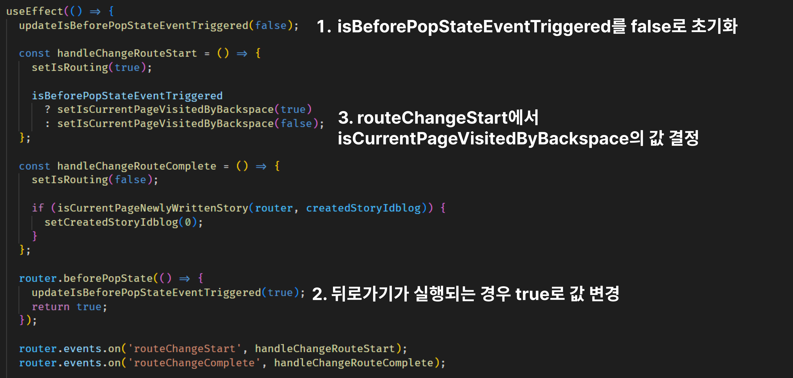
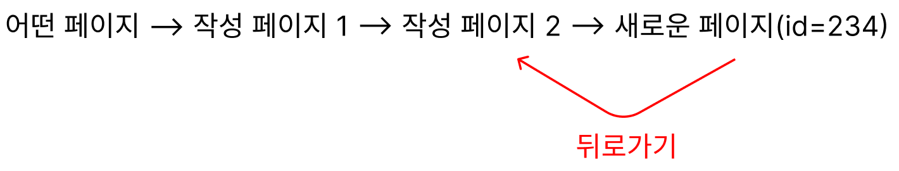

웹뷰 프로젝트를 진행하면서, dynamic routing 페이지에서 뒤로가기시 스크롤 복원 로직을 구현하면서 겪은 시행착오와 문제점들을 해결한 과정을 공유합니다. 목차는 다음과 같습니다.

#### 📌 1. file based routing과 dynamic routing에 관한 이해

#### 📌 2. dynamic routing 페이지의 특성

#### 📌 3. 용어 정의

#### 📌 4. nextjs에서 제공되는 route와 관련한 메서드들의 실행과 렌더링 및 페이지 URL 변화

#### 📌 5. 코드 레벨에서의 뒤로가기 구현

#### 📌 6. 네이버 책방의 스크롤 처리

- 스크롤 저장

- 스크롤 복원

- 어떤 글을 작성을 완료하고 뒤로가기 했을 때 글 작성 페이지로 돌아가지 않게 하는 방법

---

### 📌 1. file based routing과 dynamic routing이란?

nextjs는 file based routing이며 dynamic routing 기능을 제공합니다. file based routing이라 함은 nextjs에서 고유하게 제공하는 pages 폴더 하위의 폴더 및 파일들이 URL로 인식됨을 의미합니다. 가령 아래와 같은 폴더 구조가 있다고 가정합니다.

```
pages
  ㄴ item
      ㄴ list.tsx
      ㄴ [id].tsx

```

위와 같은 폴더 및 파일 구조를 갖는 경우, https://example.com/item/list으로 접근이 가능하고, 파일명에 대괄호가 들어가 있는 것을 통해서 dynamic routing 처리가 되어있는 것을 알 수 있습니다. 그러므로 https://exmaple.com/item/1 혹은 http://example.com/item/23 등, item 하위 경로의 아무 숫자로든 접근이 가능해집니다.

---

### 📌 2. dynamic routing 페이지의 특성

dynamic routing 페이지의 특성 중 하나는, 페이지 내에 존재하는 버튼 요소등을 통해서 동일한 dynamic routing 경로에 접근하는 경우, 그러니까 item/1 -> item/2 -> item/3 -> ... -> item/100 과 같이 이동하는 경우, [id].tsx 컴포넌트는 [unmount되지 않고 계속 사용](https://nextjs.org/docs/api-reference/next/router#resetting-state-after-navigation)됩니다. 다만, 리렌더링이 계속 발생할 뿐입니다. 이로부터 파생되는 다음 두가지 특성이 존재합니다.

#### 1. 이전 상태가 계속 유지됩니다.

item/1에서 머무르다가 item/2에 도달했을 때 값을 useState 내부 값을 초기화한 상태에서 시작하는게 아니라, item/1에 사용하던 상태와 컴포넌트가 그대로 남아있습니다. 그리고 다음과 같은 문제를 야기합니다.

- 서로 다른 item 페이지에 방문할 때마다, useEffect 내부에서 어떤 로직이 실행되길 기대한다면, dependency에 페이지 변화에 관한 변수를 넣어주어야 합니다.

- (추측) 스크롤이 복원되려는 것과 컨텐츠 내용물이 달라짐으로써 스크롤 높이가 달라지는 문제로 스크롤이 정상적인 위치로 복원되지 않는 문제가 있습니다. item/1이 item/2에 비해서 스토리 컨텐츠의 스크롤 가능 높이가 매우 길다고 가정할 때, item/2에서 item/1로 뒤로가기 하는 경우, 렌더링하는 과정과 스크롤을 복원하려는 로직의 충돌(?)로 인해 스크롤이 정상적인 위치로 복원되지 않습니다.

#### 2. 화면을 아얘 처음부터 그리지 않기 때문에 화면이 깜빡이지 않습니다.

만약 이러한 특성을 원하지 않는다면, Component에 다음과 같이 key를 할당하여 remount 시켜 상태를 초기화할수 있습니다.

```javascript
import { useRouter } from 'next/router'
import { getItem } from 'apis'

const ItemPage = () => {
  const { query } = useRouter()
  const id = +query.id
  const { data, isLoading, error } = useQuery(['item', id], getItem)

  if (isLoading || error) {
    return <></>
  }

  return <Item key={id} />
}
```

---

### 📌 3. 용어 정의

페이지 네비게이션은 다음 네가지 방법으로 일어날 수 있습니다.

- 페이지 내에서 다음 페이지로 넘어가는 요소와의 상호작용 (push)

- 뒤로가기 (backspace, 주소탭 옆의 뒤로가기 클릭)

- 앞으로가기 (forward, 주소탭 옆의 앞으로가기 클릭)

- 주소탭에 URL 직접 입력

첫번째는 단순 router.push를 하는 일반적인 상황이므로 제외하고, 나머지 케이스들 중에서 뒤로가기 케이스에 대해서만 로직을 작성했습니다.

---

### 📌 4. nextjs에서 제공되는 route와 관련한 이벤트들의 실행과 렌더링 및 페이지 URL 변화

nextjs에서 route와 관련한 이벤트 핸들러(beforePopState, routeChangeStart 등)들을 제공합니다. 스크롤 복구 로직을 구현하면서 이벤트 핸들러 내부에서의 상태 업데이트와 언제 어떻게 렌더링이 발생하여 실질적인 페이지 이동은 언제 일어나는지에 대한 이해가 필요했습니다. 관련한 코드는 [Codesandbox](https://codesandbox.io/s/naughty-aj-mihsvq?file=/pages/_app.js)에 작성해두었습니다.

앞선 Codesandbox 코드들을 렌더링 및 페이지 URL 변화 관점에서 시각화 해보면 다음과 같습니다.


먼저 push state 상황이므로 beforePopState 이벤트 핸들러는 실행되지 않습니다. 처음 렌더링(R1)은 routeChangeStart 이벤트 핸들러 내부의 상태 업데이트에 의해서 발생하고, 두번째 렌더링(R2)는 beforeNavigationStart 이벤트 핸들러에 의해 발생되고, 리렌더링이 끝나면 URL이 바뀌면서 초기 렌더링(R3)이 진행됩니다. 초기 렌더링이 끝나면 routeChangeComplete에 의해서 네번째 렌더링(R4)가 발생합니다.

rotueChangeStart 이벤트 핸들러나 beforeNavigationStart 이벤트 핸들러에서 상태를 업데이트하면 URL이 바뀌기전에 업데이트된 사항을 변경하고 다음 URL로 넘어가게 됩니다.

chatGPT는 'route가 끝나면 유저가 사용 가능한 페이지가 보여져있다고'고 설명합니다. 만약 초기 렌더링 단계의 존재를 알지 못한다면 상황에 따라서 이 문장이 조금 혼란스러울 수 있습니다.

예를들면 isRouting이라는 boolean 상태가 있다고 가정해봅시다. 그리고 routeChangeStart시 isRouting true로 만들고, routeChangeComplete시 isRouting을 false로 만들어봅니다. console.log(유저가 보는 URL, isRouting)을 로깅하면 item/2, false가 찍히는 경우가 있을텐데, 초기 렌더링이 존재함을 알지 못한다면 '라우팅도 안끝났는데 왜 URL은 바뀌어있지?'라는 생각이 들수 있습니다.

아래 뒤로가기 상황은 beforePopState만 추가되고 모두 동일합니다.


참고로 **beforePopState는 뒤로가기(back)뿐만 아니라 앞으로가기(forward)시에도 트리거**됩니다.

---

### 📌 5. 코드 레벨에서의 뒤로가기 구현

- isBeforePopStateEventTriggered

- isCurrentPageVisitedByBackspace

우선 뒤로가기와 관련한 위 두가지 변수를 먼저 설명하겠습니다.



beforePopState 이벤트 핸들러가 실행된 후 routeChangeStart 이벤트 핸들러가 실행됩니다. 뒤로가기가 발생했는지, 안발생했는지를 알기 위해서는 beforePopState가 실행됐는지 안실행됐는지를 알수 있어야합니다. 그래서 isBeforePopStateEventTriggered 변수와 업데이트 함수를 만들었습니다.

뒤로가기로직은 많은 페이지에서 사용될 것으로 예상됩니다. 그렇기 때문에 앱이 꺼지기 전까지 unmount되지 않는 \_app 컴포넌트 내에 useBackSpace훅 내에서 이벤트 리스너를 등록합니다. 뒤에서 설명하겠지만 실제 사용하는 페이지에서(예를들면 스크롤 복원이 필요한 페이지) isBeforePopStateTriggered 변수가 필요하기 때문에 export 해주었습니다.

```javascript
export let isBeforePopStateTriggered = false

export let updateIsBeforePopStateTriggered = (newValue: Boolean) =>
  (isBeforePopStateTriggered = newValue)
```

또한 단순히 flag의 역할을 위해서 사용되어 굳이 리렌더링을 유발하는 상태로 관리할 필요가 없어서 일반 변수로 선언해주었으며, react가 관리하는 상태와 햇갈릴 수 있을 것 같아서 set이라는 prefix 대신 update prefix를 붙여주었습니다.

앞선 사진속 로직을 이어서 설명하면 다음과 같습니다.

isBeforePopStateEventTriggered의 초기값을 항상 false로 만들고, beforePopState 이벤트 핸들러가 실행되면 true로 만듭니다. 그러면 routeChangeStart가 실행됐을 때 이 값이 true라면 뒤로가기가 발생한 상황이고, 그렇지 않다면 뒤로가기가 발생하지 않은 상태가 되게 됩니다.

그리고 isBeforePopStateEventTriggered는 routeChangeStart 이벤트 핸들러 내에서만 사용이 되는데, 만약 isBeforePopStateEventTriggered가 true라면 isCurrentPageVisitedByBackspace는 true가 되고 아니라면 false가 되게 됩니다.

#### 1. 스크롤 저장

스크롤 저장은 (1) push state시 혹은 (2) history stack상 맨 마지막에 존재하는 페이지에서 뒤로가기시(앞으로가기가 불가능한 페이지)에서 스크롤을 저장해야 합니다. (2)를 고려하지 않는다면, 뒤로가기 했다가 다시 앞으로가기시에 저장된 스크롤 위치가 없어서 정상적인 스크롤 복구가 이루어지지 않습니다.

저는 앞으로가기가 있는 웹의 조건이 아닌 앱의 조건만을 고려하여 구현하였으므로 (1)과 (2)를 모두 처리하는 로직은 주석처리했습니다.

```javascript
const handleChangeRouteStart = () => {
  // (1)과 (2)처리
  // if (isBeforePopStateEventTriggered && isCurrentPageVisitedByBackspace) {
  //   return
  // }

  // (1)만 처리
  if (isBeforePopStateEventTriggered) {
    return
  }

  if (scrollElementRef.current) {
    setScrollPosition([
      ...prevScrollPosition,
      {
        id,
        scroll: scrollElementRef.current.scrollTop,
      },
    ])
  }
}

events.on('routeChangeStart', handleChangeRouteStart)
```

보시다시피 스크롤 저장은 routeChangeStart 이벤트 핸들러 내에서 발생하게 되는데, isBeforePopStateEventTriggered가 true인 경우 뒤로가기 상황이고, false인 경우 push 상황이라고 생각할 수 있습니다.

(1)과 (2)를 처리하는 코드는 왜 isBeforePopStateEventTriggered && isCurrentPageVisitedByBackspace인 이유는, isCurrentPageVisitedByBackspace의 상태 업데이트와 뒤로가기시 스크롤을 저장하는 로직이 모두 routeChangeStart에서 발생하기 때문입니다. 맨 앞 페이지에서 뒤로가기를 눌러도 상태가 업데이트 되기 전에 isCurrentPageVisitedByBackspace에 접근하므로 맨 앞 페이지는 스크롤이 저장되게 되는거죠.

#### 2. 스크롤 복구

스크롤 복구는 뒤로가기가 발생했을 때만 트리거돼야 하므로 다음과 같이 isCurrentPageVisitedByBackspace가 true인 경우에만 스크롤이 복구되도록 작성해줍니다.

```javascript
useEffect(() => {
  if (isCurrentPageVisitedByBackspace) {
    const { scroll } = scrollPositions.pop()
    setScrollPositions(scrollPositions)
    scrollElementRef.current.scrollTo(scroll)
  }
}, [isCurrentPageVisitedByBackspace])
```

#### 3. 어떤 글을 작성을 완료하고 뒤로가기 했을 때 글 작성 페이지로 돌아가지 않게 하는 방법

문제 상황은 다음과 같습니다.



작성 페이지로 접근할 수 있는 페이지에서 작성 페이지로 접근하고, 두번의 네비게이션 후 작성을 완료하게 되면 작성된 글의 id를 전달받고 새로운 페이지로 넘어가게 됩니다. 그런데 여기서 뒤로가기를 했을 때 작성 페이지 1과 2를 보고싶지 않습니다. 원하는 상황은 다음과 같이 history stack이 정리되었으면 좋겠습니다.


단순히 go(-n)을 처리하자니 다시 앞으로가기하는 경우 작성 페이지1과 2를 방문할 수 있었고, history stack에서 강제로 pop하는 메서드는 존재하지 않았습니다. 그래서 workaround한 해결방법으로 접근했습니다.

```javascript
onSuccess: ({ createdItemId }) => {
  setCreatedItemId(createdItemId)
  window.history.go(-2)
}
```

우선 작성하여 생성된 게시글의 id를 전역상태로 두고, history.go(-2)해줍니다. 그리고 \_app 아래의 useBackSpace 훅 안에 다음과 같은 로직을 작성해줍니다.

```javascript
useEffect(() => {
  if (
    !isCurrentPageWritePage(router) &&
    isNewlyCreatedItemExist(createdItemId)
  ) {
    router.push(`/item/${createdItemId}`)
  }
}, [])
```

현재 페이지가 글 작성 페이지가 아니고 새로 작성된 게시글이 있는 경우에만, 새로 작성된 게시글의 페이지로 이동시킵니다. 이 로직이 실행되는 것은 오로지 (1) 글이 새로 작성되고, (2) history.go(-2)가 발생했을 때 뿐일 것 입니다.

```javascript
const handleRouteChangeComplete = () => {
  if (
    isCurrentPageNewlyCreatedPage(router) &&
    isNewlyCreatedItemExist(createdItemId)
  ) {
    setCreatedItemId(null)
  }
}
```

그리고 페이지 이동이 끝나게 되면 createdItemId를 다시 null로 초기화하기 위해 routeChangeComplete 이벤트 핸들러에 위와 같이 로직을 작성합니다.

이렇게 작성하면 글 작성을 하고 뒤로가기를 했을 때 다시 작성 페이지로 돌아가지 않게됩니다. history stack이 원하던 상태로 된것 입니다. 다만 여기에는 한가지 문제점이 있습니다. go(-2)를 하여 어떤 페이지로 이동했을 때, 이 페이지가 잠깐동안 보여진다는 것 입니다. 이를 해결하기 위해서,

```javascript
return <>{!isNewlyCreatedItemExist(createdItemId) && <Component />}</>
```

글이 생성됐으면 해당 페이지로 이동하기 전까지는 잠깐동안 페이지를 보여주지 않도록하여 마무리합니다.

---

### 📌 6. 네이버 책방의 스크롤 처리

제가 고민하는 다음 세가지 문제에 대해서 SSR 환경에서 동작하는 [네이버 책방](https://search.shopping.naver.com/book/catalog/37861973652)은 어떻게 처리했을까 확인해보았습니다.

#### 1. 앞선 2-1에서 언급했던 스크롤이 복원되려는 것과 컨텐츠 내용물이 달라짐으로써 스크롤 높이가 달라지는 문제로 스크롤이 정상적인 위치로 복원되지 않는 문제

네이버 책방은 페이지 이동시 스크롤 위치 정보 뿐만 아니라, 스크롤 가능한 길이(scroll bar의 높이) 역시도 저장합니다. 아마 이 상태를 저장하는 이유는 컨텐츠들이 다 로드돼서 스크롤 가능한 길이가 저장된 상태와 일치했을 때 스크롤을 복구하려는 이유에서 저장한게 아닐까 싶습니다.

#### 2. 페이지 1 -> 페이지 2 -> 다른 도메인 -> 페이지 1에 도달했을 때 스크롤 복원 여부

이상적으로는 페이지 1에 도달할때는 뒤로가기나 앞으로가기를 통해서 방문한게 아니니까 맨 위에 있어야 하는데, 스크롤 복원이 일어납니다.

#### 3. 페이지 1 -> 페이지 2 -> 페이지 3 🟢 -> 페이지 2 -> 페이지 3와 같이 history stack이 쌓였을 때 🟢에서 뒤로가기와 앞으로가기를 구분하지 않으면 어떠한 스크롤 위치를 복구해야 할지 모름

페이지 3에서 beforePopState가 발생하면 앞으로 가기를 해서 페이지2에 방문하거나 뒤로가기를 해서 페이지2에 방문하거나 두 가지중 하나일 것 입니다. 그러므로 뒤로가기와 앞으로가기를 구분해서 적절하게 스크롤 위치를 복원해야 한다고 생각했는데요.

네이버 책방은 스크롤을 저장할 때 페이지 URL을 남기는데, URL에는 NaPm이라는 파라미터가 남게됩니다. 이 파라미터는 동일한 페이지를 방문해도 값이 달라집니다. 아마 이 값을 고유한 id값처럼 사용하여 굳이 뒤로가기와 앞으로가기를 구분하지 않고도 페이지 복원이 가능한 것 같습니다.

