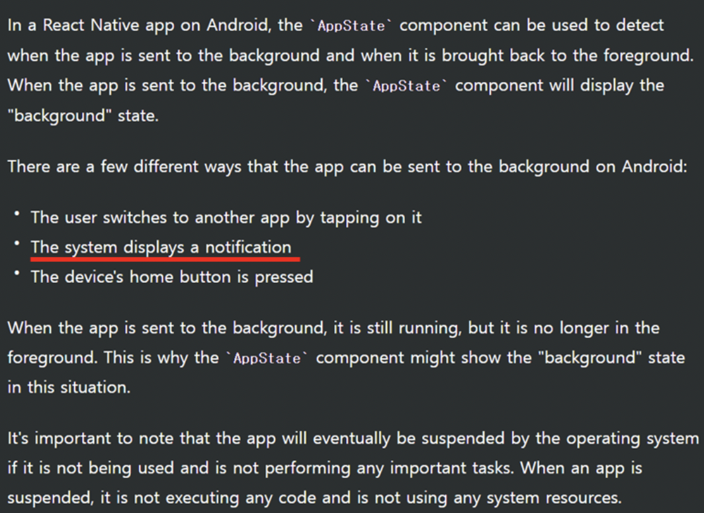

## 📌 vscode 윈도우가 켜졌을 때 파일명 바꾸기

vscode 내에서 특정 파일의 이름을 바꾸어야 할때가 많다. 더욱이 우리 프로젝트는 nx 모노 레포를 사용해서 폴더의 depth가 깊다(apps -> project -> src -> components ...🤷). 이때 sidebar를 통해서 수정하는게 여간 번거로운게 아니다. 키보드를 벗어나는 것도 귀찮다.

[File Utils](https://marketplace.visualstudio.com/items?itemName=sleistner.vscode-fileutils) extension을 이용하면 아래 이미지처럼 커멘드 팔레트를 통해서 간단하게 이동할 수 있다.


---

## 📌 branch 명 바꾸기

본인은 vscode 터미널을 이용해서 명령어를 통해 git 관련한 작업을 진행한다. 이때 브랜치 이름이 permission-request-check와 같이 길게되면 종종 명령어를 치다가 오타가 나곤한다. 복사하는 방법이 없나 하다가, 앞선 File Utils와 마찬가지로 [Git Lens](https://marketplace.visualstudio.com/items?itemName=eamodio.gitlens)에서 제공하는 기능을 이용하면 쉽게 브랜치 이름을 복사할 수 있다.


---

## 📌 권한 요청 구현

현재 앱은 사용하려면 위치, 앨범에 관한 유저의 권한 승인이 필요하다. 한가지 까다로운 상황은, 유저가 앱을 사용하다가 앱을 종료하지 않은채 앱의 설정으로가서 권한을 변경하고 앱으로 돌아왔을 때
앱 내의 권한 상태를 변경해야한다.

앱이 foreground에 있는지 background에 있는지를 구하는 방법은 쉽다. react-native에서 제공하는 AppState를 이용하면 된다. 아래 이미지와 같이 주석으로 설명도 달려있다.


그래서 아래 코드와 같이 AppState가 background에서 active가 되었을 때 권한 상태를 바꿔주는 코드를 작성할 수 있다.

```javascript
const handleReceiveMessageFromWeb = async (권한 종류) => {
    const res = await request(권한 종류); // 유저에게 권한 요청창이 등장함
    setPermissionStatus(res);
};

App.addEventListener('message', handleReceiveMessageFromWeb); // 앱이 웹으로부터 권한 요청 관련한 통신을 listen함

useEffect(() => {
  const handleAppStateChange = async(nextAppState) => {
    if (appState.match(/inactive|background/) && nextAppState === 'active') {
      const res = await check('LOCATION') // 🙋 앱의 권한 상태 변경
      setPermissionStatus(res);
    }
  }
  AppState.addEventListener('change', handleAppStateChange)
  return () => {
    AppState.removeEventListener('change', handleAppStateChange)
  }
}, [appState])
```

앱 상태와 관련한 이야기는 여기까지하고, 현재 앱은 권한이 필요한 기능에 접근할 때 권한 요청이 들어간다. 가령 내 위치로 가기 버튼을 눌렀을 때 위치 권한을 요청하여 유저의 화면에 아래와 같은 권한 설정창이 등장한다.


[이미지 출처](https://www.studytonight.com/android/permissions-in-android)

권한 요청이 실행되기 위해서 웹뷰에서 앱으로 권한 요청에 관한 통신이 일어난다. 그리고 권한 요청은 앞선 코드의 handleReceiveMessageFromWeb 내의 request 코드가 실행될때 등장한다. 문제는 이 요청이 보여지는 순간, 앞선 코드의 handleAppStateChange가 실행된다. 분명 앱에 존재하는데, 권한 요청이 뜨면 background 상태로 들어가는 것 처럼 행동하는 것이다. chatGPT에 다시 물어보니 아래와 같은 답변을 얻을 수 있었다.



결국 handleReceiveMessageFromWeb도 실행되고, handleAppStateChange도 실행돼서 setPermissionStatus가 두번 실행된다. 코드가 실행되도 정상적으로 동작하면 상관이 없을 수도 있는데, 유저가 요청에 대해서 '거부 및 다시보지 않음'을 선택하는 경우에, handleAppStateChange에서 실행된 check가 App의 상태를 blocked가 아닌 denied로 check한다. 승인이나 거부에 대해서는 granted와 denied가 정상적으로 check하는데, blocked만 상태를 denied로 check한다. -\_-...

원인을 찾지 못해서 우선은 권한 요청 창이 떠있는 경우 handleAppStateChange가 실행되지 않도록 아래와 같이 코드를 수정했다.

```javascript
const handleReceiveMessageFromWeb = async (권한 종류) => {
    setIsPermissionRequestNotificationOpen(true);
    const res = await request(권한 종류); // 유저에게 권한 요청창이 등장함
    setPermissionStatus(res);
    setIsPermissionRequestNotificationOpen(false);
};

App.addEventListener('message', handleReceiveMessageFromWeb); // 앱이 웹으로부터 권한 요청 관련한 통신을 listen함

useEffect(() => {
  const handleAppStateChange = async(nextAppState) => {
    if (appState.match(/inactive|background/) && nextAppState === 'active' && !isPermissionRequestNotificationOpen) {
      const res = await check('LOCATION') // 🙋 앱의 권한 상태 변경
      setPermissionStatus(res);
    }
  }
  AppState.addEventListener('change', handleAppStateChange)
  return () => {
    AppState.removeEventListener('change', handleAppStateChange)
  }
}, [appState, isPermissionRequestNotificationOpen])
```

---

## 📌 Typescript 에러

아래 코드가 왜 에러가 발생하는지 모르겠다. -\_-;

```javascript
const callbackFunction = (
  fn: ((oneArgument: number) => void) | (() => void),
) => {
  if (fn.length === 1) {
    fn(1)
    return
  }

  if (fn.length === 0) {
    fn() // 🤷 error that you must pass one parameter
    return
  }
}
```

리서치해도, ChatGPT에게 물어봐도 답이 안나와서 [stackoverflow](https://stackoverflow.com/questions/75116340/how-to-refine-functions-that-have-different-arity-in-typescript)에서 답변을 받았다.

0개 혹은 1개의 파라미터가 들어올 수 있는 경우에는 아래와 같이 타입을 작성하는 것이 타당하고,

```javascript
const callbackFunction = (fn: (oneArgument?: number) => void) => {
  // implementation
}
```

2개 이상의 파라미터가 들어올 수 있는 경우에는 아래와 같이 코드를 작성하는 것이 타당하다고 한다.

```javascript
const callbackFunction = (fn: (...args: any[]) => void) => {
  // implementation
}
```

---

## 📌 함수 오버로드 (Function Overloading)

Function Overloading는 서로 다른 파라미터 타입이나 서로 다른 파라미터 개수를 갖는 동일한 이름의 함수를 여러개 만드는 것이다. 참고로 Method Overloading은 서로 다른 파라미터 개수를 갖는 동일한 이름의 method를 여러개 만드는 것이다.

Javascript는 아래 코드처럼 (1) 파라미터 타입을 기재하지 않고, (2) 파라미터 개수를 확인하지 않기 때문에 다른 언어들과 같은 방식으로 Function Overloading 구현이 불가하다.

```javascript
function foo(bar) {}

foo('Superman', 'Batman')
foo()
```

아래와 같이 Javascript에서도 Overloading 닮은 모양으로 구현이 가능하지만, (1) 코드가 장황해지고 (2) 유지보수가 어려워진다.

```javascript
function concatString(s1, s2, s3) {
  if (arguments.length > 3) {
    throw new Error('signature not supported')
  }
  let s = s1
  if (s2 && typeof s2 === 'string') {
    s += `, ${s2}`
  }
  if (s3 && typeof s3 === 'string') {
    s += `, ${s3}`
  }
  return s
}
```

앞서 작성한 코드는 Typescript를 만나고 아래와 같이 작성이 가능해진다.

```javascript
function concatString(s1: string, s2?: string, s3?: string) {
  let s = s1
  if (s2) {
    s += `, ${s2}`
  }
  if (s3) {
    s += `, ${s3}`
  }
  return s
}

// ❎  now this works
concatString('one')
concatString('one', 'two')
concatString('one', 'two', 'three')

// ❌  we will get compile errors if we try to do
concatString('one', true)
concatString('one', 'two', 'three', 'four')
```

Overload Signature와 Implementation Signature 두개가 존재하며, 하나의 함수는 여러 개의 Overload Signature와 한개의 Implementation Signaure가 존재한다.

참고로 Signature은 function부터 return type까지를 의미하며, Overloading Signature은 함수의 body가 없지만, Implementation Signature은 함수의 body가 존재한다. Implementation Signature은 반드시 Overload Signature가 호환할 수 있어야 한다. 아래 코드를 보면 알수있다.

```javascript
// Overload Signature
function greet(person: string): string;
function greet(person: string[]): string;

// Implementation Signature
function greet(person: unknown): unknown {
  if (typeof person === 'string') {
    return `Hello, ${person}!`;
  } else if (Array.isArray(person)) {
    return person.map(name => `Hello, ${name}!`);
  }
  throw new Error('Unable to greet');
}
```

Function Overloading의 장점은 관련한 기능들을 한곳에 모을 수 있어 유지보수가 향상된다. 기능이 조금 차이가 난다고해서 이름이 다른 함수를 여러개 만들 필요가 없다. 단점은 Overload Signature가 많아질수록 Implementation Signature가 복잡하고 이해하기 어려워진다.

참고로 아래와 같이 선택적 파라미터로 처리할 수 있는 상황에 Function Overloading을 적용하진 말자

```javascript
// Not recommended
function myFunc(): string;
function myFunc(param1: string): string;
function myFunc(param1: string, param2: string): string;
function myFunc(...args: string[]): string {
  // implementation...
}

// OK
function myFunc(param1?: string, param2?: string): string {
  // implementation...
}
```

사용시 한가지 주의해야하는 것은 타입스크립트는 첫 번째로 만족되는 Overload Signature를 함수를 호출할 때 처음으로 매칭되는 Overload Signature를 호출하기 때문에 순서가 중요하다.

```javascript
function fn(x: unknown): unknown;
function fn(x: number[]): number;
function fn(x:any) {
    return x;
}

//call the function with a number array and expect a number back
var x = fn([1,2,3]); //  x is unknown
```

위 코드를 다음과 같이 수정하면 error가 사라진다.

```javascript
function fn(x: number[]): number;
function fn(x: unknown): unknown;
function fn(x:any) {
    return x;
}

var x = fn([1,2,3]); // x: number
```

[Mastering Function Overloading in TypeScript](https://betterprogramming.pub/mastering-function-overloading-in-typescript-97108369570a)

[A Simple Explanation of Function Overloading in TypeScript](https://dmitripavlutin.com/typescript-function-overloading/#1-the-function-signature)

[Function Overloading / Method Overloading TypeScript](https://www.tektutorialshub.com/typescript/function-overloading-method-overloading-typescript/)

---

## 📌 namespace, module, declare, Ambient Code

namespace와 module의 역할은 동일하게 관련한 코드들을 그룹핑하여 이름이 충돌하거나 전역 스코프가 오염되는 것을 막는 것이다. 유일한 차이점은 namespace는 여러 파일에서 확장될 수 있고, module은 하나의 파일 안에서만 정의 된다는 것입니다. 또한 최신 Typescript에서 namespace는 deprecated되어, module의 사용이 권장됩니다.

```javascript
module MyModule {
    export function doSomething() {
        console.log("I'm doing something!");
    }
    export class MyClass {
        // class code here
    }
}

// usage
import { MyModule } from "./myModule";
MyModule.doSomething();
```

```javascript
// myNamespace.ts
namespace MyNamespace {
    export function doSomething() {
        console.log("I'm doing something!");
    }
}

// myNamespace2.ts
namespace MyNamespace {
    export class MyClass {
        // class code here
    }
}

import * as MyNamespace from "./myNamespace";
MyNamespace.doSomething();
const myClass = new MyNamespace.MyClass();
```

declare은 타입스크립트 컴파일러에게 "이 변수나 모듈은 어딘가에 존재하고, 타입은 이거야"라고 말하는 것이다. 예를 들어보자. Typescript React App에 Webpcack Hot Middleware가 존재한다. 하지만 Webpack Hot Middleware는 순수 Javascript로 작성됐다. 그래서 타입스크립트가 체크할 수 있는 타입 선언이 존재하지 않는다.

Webpack Hot Middleware는 module이 존재하고 내부에 hot이라는 프로퍼티가 존재한다. 만약 module.hot에 접근하려고하면 타입스크립트는 "property 'hot' does not exist"라는 에러를 만들어낸다. 이때 우리는 declare 키워드를 사용하여 에러 제거가 가능하다.

```javascript
declare let module: any
```

만약 여기서 declare 키워드를 지운다면 "'module' already exists"라는 에러가 발생하게 될것이다. 위 코드만 보면 declare가 어떤 코드를 생성하는 것 처럼 보이지만, 어떠한 변수나 모듈도 생성하지 않는다.

다른 예로, 아래 코드는 순수하게 javascript로 쓰여진 jQuery의 변수 중 일부를 declare를 통해서 사용하는 것이다.

```javascript
declare let $: any;

$(document).ready(() => {
    console.log("jQuery is ready!");
});
```

Ambient 코드는 애플리케이션에 존재하지 않고 외부 라이브러리에서 제공해주는 코드를 의미한다. declare를 사용하는 것은 변수나 모듈이 ambient고 자바스크립트 코드를 생성하지 말라고 타입스크립트 컴파일러에게 말하는 것과 같다.

[chatGPT](https://chat.openai.com/chat)

[Purpose of declare keyword in TypeScript](https://stackoverflow.com/questions/43335962/purpose-of-declare-keyword-in-typescript)

