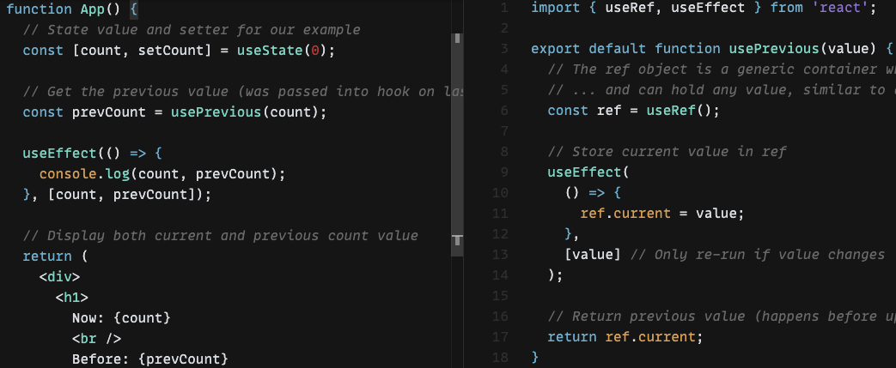
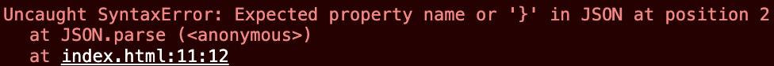
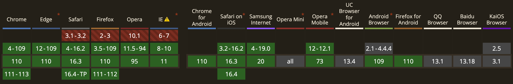

## 📌 axios와 react-query의 캐시 동작

bfcache 이론에 근거하면 뒤로가기 했을 때 데이터 요청이 발생하면 안된다. 하지만 현재 프로젝트는 뒤로가기 했을 때 데이터 요청이 발생한다. 팀장님께서 일전에 axios가 무조건 데이터를 요청하도록 설정해놨는데 혹시 이게 문제가 되는게 아닌지 확인해 봐달라고 하셨다. bfcache가 애초에 동작하지 않고 있어서 이러한 추론은 타당하기 어려워보였지만, axios의 캐시 설정과 react-query의 캐시 설정에 따라서 요청이 어떻게 처리되는지 궁금해서 테스트해봤다.

1. axios 및 react-query 모두 캐시를 설정하지 않으면 당연하게도 무조건적인 네트워크 요청이 발생한다.
2. axios 캐시 설정을 제거하고, react-query 캐시 옵션을 설정하면 캐시된 데이터에 한해서는 네트워크 요청 탭에 요청 항목이 보여지지 않는다.
3. react-query 캐시 설정을 제거하고, axios 캐시 옵션을 설정하면 캐시된 데이터에 한해서는 네트워크 요청 탭에 요청 항목이 보여지지만 disk cache로부터 반환된다.
4. axios 및 react-query 모두 캐시를 설정하면 캐시된 데이터에 한해서는 네트워크 요청 탭에 요청 항목이 보여지지 않는다.

react-query에서 캐싱을 설정하지 않으면 axios에서 설정해놓은 캐싱 결과가 동작하는 것 같다. 별개로 disk cache 뿐만 아니라 memory cache도 존재하는데, [둘의 차이](https://stackoverflow.com/questions/44596937/chrome-memory-cache-vs-disk-cache)는 disk cache는 데이터가 하드 드라이브에 저장되고 탭을 닫아도 데이터가 사라지지 않는 비휘발성 공간인 반면에 memory cache는 데이터가 ram에 저장되고 탭을 닫으면 사라지는 휘발성 데이터라고한다.

## 📌 usePrevious에 관한 이해

작업을 하면서 아래 코드의 동작이 잘 이해가 안갔다.


[코드 출처](https://codesandbox.io/s/pwnl6v7z6m)

App 컴포넌트 내의 useEffect 내부에서 count와 prevCount를 비교하면 prevCount가 항상 이전값을 보여준다. 대부분의 사람들의 경우 너무나 당연하게 이해할 수 있었을지 모르겠지만, 불행하게도 나는 아니었다. 내가 생각한 것은 다음과 같다. useEffect는 렌더링이 된 후에 실행된다. 그러므로 ref.current가 이후의 값으로 바뀌는 것도 렌더링이 된 후이다. 더불어서 App 컴포넌트 내의 useEffect 내의 prevCount는 이미 값이 바뀌어 있으므로 log에서 count와 prevCount가 같은 값을 가져야한다. 하지만 그렇지 않다.

답은 너무나 간단하게도 다음 문에 있다.

```javascript
const prevCount = usePrevious(count);
```

그러니까 이전 값을 prevCount라는 변수에 저장하고, ref라는 참조값에 접근하지 않기 때문에 항상 이전값을 보여줄 수 있는 것이다.

## 📌 usePrevious 강화하기

본 목차는 [Implementing advanced usePrevious hook with React useRef](https://www.developerway.com/posts/implementing-advanced-use-previous-hook)의 내용을 정리했다. usePrevious 코드를 구글링해보면 일반적으로 다음과 같이 작성된 코드를 볼수있다.

```javascript
const usePrevious = value => {
  const ref = useRef();

  useEffect(() => {
    ref.current = value;
  });

  return ref.current;
};
```

그런데 이 훅은 한가지 문제점을 안고있다. value가 바뀌지 않았음에도 불구하고, 다른 상태에 의해서 리렌더링이 발생하면 value와 ref.current가 동일해지는 순간이 올수 있다는 것이다. 예를들면 다음과 같이 코드가 작성돼있다고 가정해보자.

```javascript
function App() {
  const [count, setCount] = useState(0);
  const [_, forceRerender] = useState({});

  const prevCount = usePrevious(count);

  useEffect(() => {
    console.log(count, prevCount);
  }, [count, prevCount]);

  return (
    <div>
      <button onClick={() => forceRerender({})}>force rerender</button>
      <button onClick={() => setCount(count + 1)}>Increment</button>
    </div>
  );
}
```

만약 Increment 버튼을 네번 누르면 useEffect 내의 log는 순서대로 3과 2를 찍을 것이다. 헌데 만약 force rerender 버튼에 의해서 리렌더링이 발생하는 경우, log는 순서대로 3과 3을 찍게된다. count의 상태가 변하지 않았음에도 prevCount의 값이 변하는 것이다.

이러한 문제를 해결하기 위해서 usePrevious를 다음과 같이 수정할 수 있다. 이 경우 prev 상태를 애초에 들고 있으므로, 렌더링이 된 후에 prev 값을 변경하려고 useEffect를 굳이 사용하지 않아도 된다.

```javascript
export const usePreviousPersistent = <TValue extends unknown>(
  value: TValue
) => {
  const ref = useRef<{ value: TValue; prev: TValue | null }>({
    value: value,
    prev: null
  });

  const current = ref.current.value;

  if (value !== current) {
    ref.current = {
      value: value,
      prev: current
    };
  }

  return ref.current.prev;
};
```

만약 객체를 비교해야 하는 경우 deep equality를 사용해야 하지만 글쓴이는 라이브러리에 따라서 속도가 느릴 수 있어서 별로 선호하지 않는다고 한다. 그래서 matcher 함수를 전달하는 다음 방식을 제안하고 있다.

```javascript
export const usePreviousPersistentWithMatcher = <TValue extends unknown>(
  value: TValue,
  isEqualFunc: (prev: TValue, next: TValue) => boolean
) => {
  const ref = useRef<{ value: TValue; prev: TValue | null }>({
    value: value,
    prev: null
  });

  const current = ref.current.value;

  if (isEqualFunc ? !isEqualFunc(current, value) : value !== current) {
    ref.current = {
      value: value,
      prev: current
    };
  }

  return ref.current.prev;
};
```

### 📌 localStorage 안전하게 사용하기

본인이 프로그래머스 데브코스를 수강할 때 바닐라 자바스크립트 멘토님께서 localStorage를 다음과 같이 사용하셨다.

```javascript
const storage = window.localStorage;

const getItem = (key, fallbackValue) => {
  try {
    const res = storage.getItem(key);

    return res ? JSON.parse(res) : fallbackValue;
  } catch (e) {
    console.error(e.message);
    return fallbackValue;
  }
};

export default {
  getItem,
  setItem,
};
```

위 코드의 getItem 내부에서 왜 try ~ catch 문을 써야하는지다. 당시에 워낙 수업 따라가기도 힘들었어서 제대로 짚고 넘어가지 못한 부분이었는데, 하필 강사님이 계신 회사에 면접을 보러갔을 때 강사님께서 왜 저렇게 작성한건지 알고 있냐고 물어보셨었다. 그 당시에 강사님께서 이유를 알려주셨었는데, 이번에 데브매칭 시험을 공부하면서 이유를 까먹어 다시 찾아보았다.

우선 강사님이 알려주신 이유와 별개로 한가지 이유가 더 존재하는데 다음과 같다.

1. JSON.parse시 발생할 수 있는 에러
2. localStorage가 지원되지 않는 환경에서 발생하는 에러

1은 다음과 같다. storage에 저장할 때는 JSON.stringify를 이용해서 저장하는데 어떤 경유로 `{ a : 1` 이라는 객체가 저장됐다고 가정해보자. 그리고 이 객체를 다시 가져와서 JSON.parse 하려고 할때 다음과 같은 에러가 발생하게 된다.



에러가 의미하는대로, 두번째 프로퍼티(at position2)가 와야하는데 생략이 되었거나, 두번째 프로퍼티가 오지는 않는데 `}`를 기입하지 않아서 발생하는 에러다. 만약 아래와 같이 try ~ catch를 사용하지 않고 코드를 작성하면 프로그램이 멈출수도 있기 때문에 catch 문에서 에러를 포착하여 fallbackValue를 내놓는 것이다.

```javascript
const res = JSON.parse(localStorage.getItem(2)); // 에러 발생
console.log(res); // 실행되지 않음
```

2는 다음과 같다. 우선 [Can i use?](https://caniuse.com/)를 통해 localStorage와 sessionStorage가 어떤 브라우저에서 지원되지 않는지 찾아봤다.

localStorage는 다음과 같다.
;

sessionStorage는 다음과 같다.
;

그렇다면 이렇게 지원이 안되는 상황에서 코드가 작동하도록 하기 위해서는 어떻게 작성해야 할까? [How to Use LocalStorage Safely](https://javascript.plainenglish.io/how-to-use-localstorage-safely-a96eb50fbb4e)에서는 다음과 같이 사용하는 것을 제시하고 있다.

```javascript
function isSupportLS() {
  try {
    localStorage.setItem('_ranger-test-key', 'hi');
    localStorage.getItem('_ranger-test-key');
    localStorage.removeItem('_ranger-test-key');
    return true;
  } catch (e) {
    return false;
  }
}

class Memory {
  constructor() {
    this.cache = {};
  }
  setItem(cacheKey, data) {
    this.cache[cacheKey] = data;
  }
  getItem(cacheKey) {
    return this.cache[cacheKey];
  }
  removeItem(cacheKey) {
    this.cache[cacheKey] = undefined;
  }
}

export const storage = isSupportLS() ? window.localStorage : new Memory();
```

그러니까 isSupportLS 함수를 실행하여 에러가 발생하면 브라우저 저장소가 아닌 웹사이트 내부의 Memory에 저장하는 방법을 제시하고 있다. 하지만 [Javascript Try Catch for Localstorage Detection](https://stackoverflow.com/questions/14154478/javascript-try-catch-for-localstorage-detection)에서 isSupportLS 보다 더 간단하게, 그리고 Edge case까지 고려하여 작성하는 방법을 제시하고 있다.

```javascript
function supports_html5_storage() {
  try {
    return 'localStorage' in window && window['localStorage'] !== null;
  } catch (e) {
    return false;
  }
}
```

해당 게시글을 들어가면 알겠지만, 위 함수에서 try ~ catch 문을 사용하는 이유는 오래된 Firefox는 쿠키 사용을 꺼놨을 때 예외가 발생할 수 있는 버그가 있다고 한다.

그러므로 코드를 다음과 같이 완성할 수 있게된다.

```javascript
function supports_html5_storage() {
  try {
    return 'localStorage' in window && window['localStorage'] !== null;
  } catch (e) {
    return false;
  }
}

class Memory {
  constructor() {
    this.cache = {};
  }
  setItem(cacheKey, data) {
    this.cache[cacheKey] = data;
  }
  getItem(cacheKey) {
    return this.cache[cacheKey];
  }
  removeItem(cacheKey) {
    this.cache[cacheKey] = undefined;
  }
}

export const storage = supports_html5_storage()
  ? window.localStorage
  : new Memory();
```
