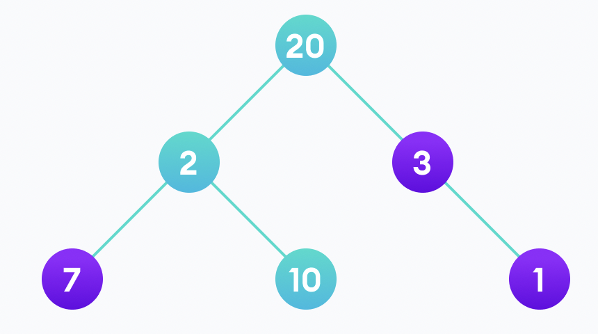

## 📌 Dynamic Programming

다이나믹 프로그래밍은 (1) 어떤 문제를 하위 문제로 쪼갤 수 있고, (2) 어떤 문제의 하위 문제가 겹치고, (3) optimal substructure 특성을 가지고 있을 때 도움이되는 기술이다. 앞서 말한 세가지 조건이 만족될 때, 하위 문제의 해답을 저장하고 필요할때 재사용함으로써 CPU의 연산량을 줄여 효율성을 향상시킬 수 있다.

> 만약 어떤 문제 A를 구성하는 하위 문제들이 최적의 해답으로 해결됐을 때, A 문제 역시도 최적의 해답으로 해결된다면, A 문제는 optimal substructure 하다고 말할 수 있다. [wikipeida](https://en.wikipedia.org/wiki/Optimal_substructure)

피보나치 수열을 예로 들어보자. 피보나치 수열은 0, 1로 시작하며 다음에 오는 숫자는 이전 두개의 숫자의 합이 되는 수열을 말한다. 다섯 자리까지 구하는 경우 아래와 같이 구할 수 있다.

F(0) = 0

F(1) = 1

F(2) = F(1) + F(0)

F(3) = F(2) + F(1)

F(4) = F(3) + F(2)

이를 통해서 '하위 문제의 해답을 저장하고 필요할때 재사용함'을 알수있다. 그리고 이러한 기술을 memoization이라고 한다.

사실 다이나믹 프로그래밍 구현에는 memoization과 tabulation이라는 두가지 기술이 존재한다. memoization을 이용한 다이나믹 프로그래밍은 top-down 방식으로 볼수 있다. 이미 모든 하위 문제의 해답을 계산했다고 '가정'하며, 해답을 구하는 순서에 대해 관심갖지 않고 단순히 재귀 함수(recursion)를 호출할 뿐이다. 보통 a(n) = a(n-1) + a(n-2)의 재귀적인 구조로, 코드가 직관적인 장점이 있지만, 메모리 스택이 쌓인다는 단점이 있다.

반면 Tabulation은 bottom-up 방식이다. Tabulation은 도표 작성이라는 뜻으로, 이를 이용한 다이나믹 프로그래밍을 table-filling 알고리즘이라고 부르기도 한다. memoization과는 다르게 해답을 구하는 순서를 미리 정해야한다. 예를들면 피보나치에서 a(0)과 a(1)을 먼저 구하여 저장하고(table-filling), 순차(iteration)적으로 a(i) = a(i-1) + a(i-2)를 구한다. 메모리 스택에 대한 걱정이 없고, 함수 호출에 대한 overhead가 없기 때문에 성능적으로 유리하지만, 순서를 미리 정해야하는 단점이 있다.

다이나믹 프로그래밍과 함께 많이 언급되는 것이 탐욕 알고리즘(Greedy Algorithm)이다. 두개의 차이점에 대해서 알아보아야 하는데, 이는 탐욕 알고리즘 목차에서 알아보도록 하자.

[programize](https://www.programiz.com/dsa/dynamic-programming)
[when to use bottom-up DP and when to use top-down DP](https://stackoverflow.com/questions/6164629/what-is-the-difference-between-bottom-up-and-top-down)
[What is the difference between bottom-up and top-down?](https://stackoverflow.com/questions/6164629/what-is-the-difference-between-bottom-up-and-top-down)

---

## 📌 Greedy Algorithm

매순간 주어지는 정보로만 최적의 해답을 선택한다. 이 선택이 전체적인 관점에서 최적의 해답이 되지 못할 수 있다. 예를들면, 청첩장을 받은 사람이 결혼식장에 가려고 하는데, 늦잠을 자버렸다고 하자. 식장까지 이동 수단의 선택지가 전철과 택시가 있다고 했을 때 최적의 해답은 택시를 타는 것이 된다. 택시를 타고 이동하는데, 마라톤 행사로 인해서 5블럭까지 직진을 할수 없는 상황에 부딪혔다. 만약 마라톤 행사에 대한 정보를 고려했다면 전철을 타고 늦지 않을 수 있었다.

또다른 예는 아래 트리의 루트로부터 비용이 가장 많은 노드를 거쳐서 이동하는 경우를 생각해보자. 20부터 시작해서 2와 3을 선택해야 할때, 3이 비용이 더크니 3을 선택하고, 최종적으로 1을 선택해서 총 비용이 24가 나온다. 만약 2를 선택하고 10을 선택했다면 32라는 비용을 얻을 수 있게된다.

Dynamic Programming과 Greedy Algorithm은 모두 최적화 문제를 해결하는데 사용된다. 중요한 차이점은, Dynamic Programming은 항상 최적의 해답을 보장하지만, Greedy Algorithm은 항상 최적의 해답을 보장하지 못한다.

추가적으로 Dynamic Programming은 이전에 구해놓은 해답을 이용하기 때문에 메모리가 필요하지만, Greedy Algorithm은 매순간 해답을 선택하기 때문에 상대적으로 메모리가 필요하지 않다.

[programize](https://www.programiz.com/dsa/greedy-algorithm)
[Difference Between Greedy Method and Dynamic Programming](https://byjusexamprep.com/difference-between-greedy-and-dynamic-programming-i)

