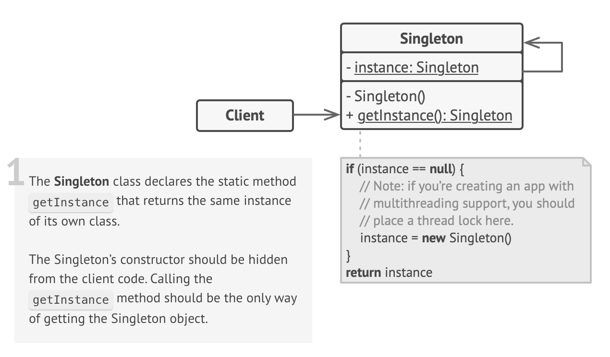

본 글은 [refactoring.guru](https://refactoring.guru/), [sbcode](https://sbcode.net/typescript/), [patterns.dev](https://www.patterns.dev/posts/proxy-pattern/)의 내용을 참고, 번역했습니다.

## 📌 Singleton

하나의 클래스가 하나의 인스턴스만 갖는 것을 보장하고, 이 인스턴스를 전역에서 접근할 수 있도록 합니다.

Singleton 패턴은 다음 두가지 문제를 해결해줍니다.

첫번째는 하나의 클래스가 하나의 인스턴스만 갖도록 합니다. 왜 클래스가 가질 수 있는 인스턴스의 개수를 제한하려는 것일까요? 이는 **공용으로 사용되는 자원**의 접근을 제한하기 위함입니다. 가령 데이터 베이스를 연다거나, 로깅 컴포넌트를 사용하는 등이 좋은 예가 될수 있습니다.

구현 원리는 처음 생성자를 호출할 때는 새로운 인스턴스를 만들어주고, 이후에 생성자를 호출할 때는 기존의 인스턴스를 리턴해주는 방식입니다. guru에서는 일반적인 생성자를 호출해서 Singleton 클래스를 만들 수 없다고 말하지만, sbcode에서는 생성자를 호출해서 Signleton 클래스를 구현하고 있습니다.

두번째는 전역에서 접근 가능하다는 점입니다. 앞서 설명한 내용과 동일합니다. 처음에 생성자를 호출할 때는 새로운 인스턴스를 만들고, 이후에는 기존의 인스턴스를 리턴하는 방식이, 전역 어디서든 첫 인스턴스에 접근 가능하다는 것입니다. 전역 변수처럼요. 하지만 전역 변수와는 다르게 overwrite의 문제가 존재하지 않습니다.

UML 다이어그램은 아래와 같습니다.



앞서 이야기 했던 것 처럼, guru에는 생성자를 호출해서 Singleton 클래스를 만들 수 없다고 이야기하지만, sbcode에서는 생성자를 호출해서 Singleton 클래스를 만들고 있습니다. 각각의 사이트가 어떤 코드를 제시했는지 확인해볼까요?

먼저 guru 입니다.

```javascript
class Singleton {
  private static instance: Singleton

  private constructor() {}

  public static getInstance(): Singleton {
    if(!Singleton.instance) {
      Singleton.instance = new Singleton()
    }

    return Singleton.instance;
  }
}

function clientCode() {
  const s1 = Singleton.getInstance()
  const s2 = Singleton.getInstance()

  if(s1 === s2) {
    console.log('Singleton works')
  } else {
    console.log('Singleton fails')
  }
}

clientCode()
```

정적 메서드를 만들어서 호출해야지만 instance를 만들거나 얻을 수 있습니다.

다음은 sbcode 입니다.

```javascript
class Singleton {
  static Instance: Singleton
  id: number

  constuctor(id: number) {
    this.id = id

    if (Singleton.instance) {
      return Singleton.instance
    }

    Singleton.instance = this
  }
}

const OBJECT1 = new Singleton(1)
const OBJECT2 = new Singleton(2)

console.log(OBJECT1 === OBJECT2) // true
console.log(OBJECT1.id) // 1
console.log(OBJECT2.id) // 2
```

둘 다 Singleton 패턴을 잘 구현하고 있다. 지극히 개인적으로는 guru의 경우 new 키워드를 호출하는게 아니라 getInstance를 호출함으로써 new 호출을 하는, Singleton 클래스가 아닌 클래스들과 구분이 된다는 장점이 있지만, constructor에 private이라는 타입 시스템의 접근 수준 제한자가 사용됐기 때문에, 런타임에 Singleton 클래스의 역할을 잃을 가능성이 존재하는 것 같다. 후자의 경우, 이러한 문제점은 없지만 new 키워드를 사용해야 한다는 단점이 있다.

추가적으로, 위 두 코드를 통해서 왜 전역 객체처럼 overwrite 상황이 안펼쳐지는지 알수있다.

장점은 앞서 말한 것 처럼 (1) 하나의 클래스가 하나의 인스턴스만 갖는 것을 보장하고, (2) 전역에서 접근 가능하다.

단점은, (1) 단일 책임 원칙이 위배되고, (2) 멀티 스레드 환경에서는 Singleton 인스턴스가 여러개 생성될 수 있으며, (3) 프로그램을 구성하는 컴포넌트가 서로를 너무 잘 알게되고, (4) 단위 테스트가 어려워진다.

단점에 대해서는 배경 지식이 요구되어 추후 더 정리하려고 한다.🤮

Singleton 패턴의 사례는 게임 경기와 리더 보드를 생각하면 좋을 듯 하다. 각각의 게임들은 각각의 클래스로부터 인스턴스를 만들지만, 각 게임들은 하나의 리더 보드를 공유한다. 구체적인 UML과 코드는 [sbcode](https://sbcode.net/typescript/singleton/)를 참고하도록 하자.

