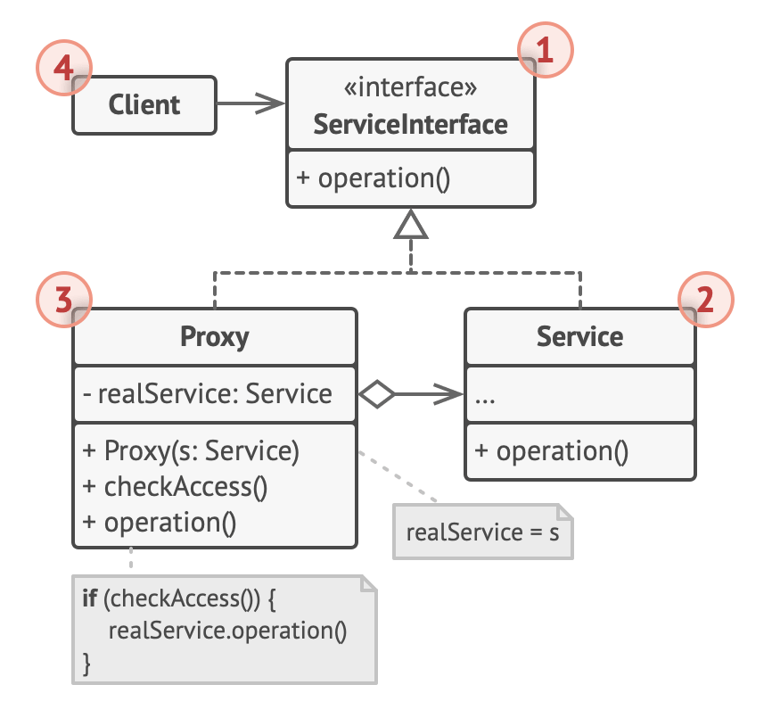

본 글은 [refactoring.guru](https://refactoring.guru/), [sbcode](https://sbcode.net/typescript/), [patterns.dev](https://www.patterns.dev/posts/proxy-pattern/)의 내용을 참고, 번역했습니다.

## 📌 Proxy

원본 객체에 대한 인터페이스(혹은 substitute 혹은 placeholder)로 원본 객체로 위장하여 원본 객체에 대한 접근을 제어합니다. Mongkey Patching, Object Augmentation, Surrogate 라고도 불립니다.

참고로 [Monkey Patching](https://www.audero.it/blog/2016/12/05/monkey-patching-javascript/)이란, 런타임에 기존 코드를 수정하는 일 없이 기존 코드에 기능을 추가하거나, 기존 코드의 기능을 변형하거나, 기존 코드의 기능을 제거하는 테크닉을 의미합니다.

간단한 예시를 하나 들어보겠습니다. 우리는 console.log를 디버깅을 위해서 사용하거나 변수가 어떤 값을 갖고 있는지 알기 위해서 사용하곤 합니다. 모든 것이 잘 동작하지만, 여기에 더해서 console.log가 호출될 때 날짜와 시간이 찍히길 원할 수도 있습니다. 그리고 이는 mongkey patching 기법을 이용해서 아래와 같이 구현이 가능합니다.

```javascript
var log = console.log

console.log = function () {
  log.apply(console, [new Date().toString()].concat(arguments))
}
```

기존의 console.log는 log 변수에 저장함으로써 변경이 일어나지 않고, console의 log 프로퍼티를 오버라이드 하고 날짜와 arguments를 log 변수에 전달하면서 console.log에 기능을 추가했습니다.

다시 proxy로 돌아와서, 그렇다면 원본 객체에 대한 접근을 제어하는 이유가 무엇일까요? 이는 다음 proxy 타입들을 보면 알수 있습니다.

1. Virtual Proxy 
>[Lazy Initialization](https://en.wikipedia.org/wiki/Lazy_initialization)을 하는 proxy로, Lazy Initialization은 당장 필요하지 않은 무거운 원본 서비스 객체가 시스템상의 자원을 차지하면서 존재하기 보다는, 정말 필요할 때까지 객체의 생성이나 초기화를 미루는 것입니다.

2. Remote Proxy
>원본 서비스 객체가 원격 서버에 존재할 때, 네트워크를 통해서 요청을 보내기 위한 자질구레한 작업들을 수행하는 proxy입니다.

3. Protection Proxy
>특정 클라이언트만 원본 서비스 객체에 접근할 수 있도록 할때 사용하는 proxy로, 만약 원본 서비스 객체가 OS의 일부분으로 매우 중요하고, 여러 개의 클라이언트가(악의적인 클라이언트가 포함되어 있을 수 있는) 이에 접근하려고 할때 사용할 수 있습니다.

4. Logging Proxy
>원본 서비스 객체에 요청을 전달하기 전에 log를 남깁니다. 이를 통해서 요청에 대한 history를 남길 수 있습니다.

5. Caching Proxy
>클라이언트 요청 결과의 일부를 캐싱하고 lifecycle을 관리하는 proxy입니다.

6. Smart Reference
>원본 서비스 객체를 이용하는 클라이언트가 없는 경우에, 해당 원본 서비스 객체가 차지하고 있는 자원을 해제할 수 있습니다. proxy는 원본 서비스 객체를 참조하고 있는 클라이언트를 계속 추적합니다. 만약 참조하는 클라이언트가 없는 경우, 생성된 원본 서비스 객체에 할당된 자원을 제거합니다.

proxy는 현실 세계의 신용 카드에 비유할 수 있습니다. 신용 카드는 은행 계좌에 대한 proxy가 될수 있고, 현금에 대한 proxy가 될수도 있습니다.


소비자 입장에서는 돈뭉치를 들고다니며 지불하지 않아도 편하고, 가계 주인 입장에서는 지불받은 금액이 곧바로 계좌로 가기때문에 행여 강도에 의해서 잃어버리거나 관리할 필요가 없어져서 편합니다.
(관계가 좀 햇갈리는데, 크게 클라이언트, proxy, 서비스 객체가 존재한다면, 클라이언트는 카드를 받은 가게 사장님이되고, proxy는 카드 그 자체이며, 서비스 객체는 은행 계좌로 해석하면 되지 않을까 싶습니다. 💶)

UML 다이어그램은 아래와 같습니다.



원본 서비스 객체(Service)의 타입 인터페이스인 Service Interface를 선언합니다. proxy는 자기 자신을 원본 서비스 객체로 위장하기 위해서 이 인터페이스를 무조건적으로 따라야 합니다. 그리고 클라이언트는 원본 서비스 객체나 proxy 모두와 동작이 가능합니다.

코드로 본다면 아래와 같습니다.

```javascript
interface Subject {
  request(): void;
}

class RealSubject implements Subject {
  public request(): void {
    console.log('RealSubject: Handling request');
  }
}

class Proxy implements Subject {
  private realSubject: RealSubject;

  constructor(realSubject: RealSubject) {
    this.realSubject = realSubject;
  }

  public request(): void {
    if(this.checkAccess()) {
      this.realSubject.request();
      this.logAccess();
    }
  }

  private checkAccess(): boolean {
    console.log('Proxy: Checking access prior to firing a real request.');
  }

  private logAccess(): void {
    console.log('Proxy: Logging the time of request.');
  }
}

function clientCode(subject: Subject) {
  subject.request();
}

console.log('Client: Executing the client code with a real subject');
const realSubject = new RealSubject();
clientCode(realSubject);

console.log('Client: Executing the same client code with a proxy');
const proxy = new Proxy(realSubject);
clientCode(proxy);
```

proxy의 장점으로는 (1) 클라이언트가 원본 서비스 객체에 대해 알 필요 없이 제어가 가능하며, (2) 라이프 사이클도 관리할 수 있습니다. (3) 프록시는 원본 서비스 객체가 준비가 안된 상태라도 작업이 가능하며, (4) 원본 서비스 객체나 클라이언트를 변경하지 않고 새로운 proxy 도입이 가능하기 때문에 개방/폐쇄 원칙을 지킬 수 있습니다.

단점으로는 (1) 수많은 새로운 클래스들을 도입해야 하기때문에 복잡해질 수 있고, (2) 응답이 지연될 수 있습니다.

---

## 📌 Facade

라이브러리나 프레임워크에 대한 간단하고 편리한 인터페이스를 제공합니다.

### 1. Problem and Solution

매우 복잡한 SubSystem(라이브러리나 프레임워크)에 속한 광범위한 객체 집합들과 함께 동작해야하는 코드를 작성한다고 상상해보세요. 보통 이러한 객체들은 초기 내용을 설정하고, 의존성을 추적하고, 올바른 순서대로 메서드가 실행돼도록 해야합니다. 결과적으로는 당신의 클래스 내 비지니스 로직들이 라이브러리 클래스의 구현 내용들과 강하게 결합되면서 이해하기 어렵고 유지보수하기 힘든 코드가 만들어지게 됩니다.

Facade는 SubSystem이 갖고 있는 수많은 기능을 제공하는 것이 아니라 몇몇의 기능만 제공하며, 복잡한 SubSystem 대한 간단한 인터페이스를 제공하는 클래스입니다.

현실 세계에서 전화 주문을 생각하면 쉽습니다. 주문을 위해서는 주문, 지불, 배달에 대한 과정(SubSystem)을 직접 밟아야 하지만, 전화 상담원(Facade)을 통해서 이러한 과정을 쉽게 처리할 수 있습니다.


### 2. Pros and Cons

복잡한 하위 시스템의 코드를 분리할 수 있다는 장점이 있지만, god object가 될수도 있다는 단점도 존재합니다.

### 3. Code

```typescript
class SubSystemA {
  // 내부가 매우 복잡하다고 가정한다.
  method() {
    return 1
  }
}

class SubSystemB {
  // 내부가 매우 복잡하다고 가정한다.
  method(value) {
    return value
  }
}

class SubSystemC {
  // 내부가 매우 복잡하다고 가정한다.
  method(value) {
    return value + 2
  }
}

class Facade {
  subSystemClassA() {
    return new SubSystemClassA().method()
  }

  subSystemClassB(value) {
    return new SubSystemClassB().method(value)
  }

  subSystemClassC(value) {
    return new SubSystemClassC().method(value)
  }

  operation(valueB, valueC) {
    return (
      subSystemClassA().method() +
      subSystemClassB().method(valueB) +
      subSystemClassC().method(valueC)
    )
  }
}

// 하위 시스템을 다이렉트로 사용하는 경우
console.log(
  new SubSystemClassA().method() +
    new SubSystemClassB().method(2) +
    new SubSystemClassC().method(3),
) // 8

// 간단한 Facade를 통해서 하위 시스템을 사용하는 경우
const facade = new Facade()
console.log(facade.operation(2, 3)) // 8
```

