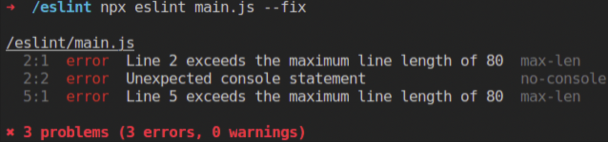

## 📌 ESLint란?

Eslint는 **ES**와 **Lint**가 합쳐진 단어입니다. ES는 ECMAScript로 아마도 잘 알고 계시지만, Lint는 처음 봤을수도 있는데요. wikipedia에서는 다음과 같이 정의합니다.

> 린트(lint) 또는 린터(linter)는 소스 코드 를 분석하여 프로그램 오류, 버그, 스타일 오류, 의심스러운 구조체에 표시(flag)를 달아놓기 위한 도구들을 가리킨다.

느낌이 올듯 말듯... 구글에 Lint를 검색해봅니다.


위와 같이 lint roller가 나오는 것을 확인할 수 있습니다. 오래된 스웨터들을 보면 옷에 삐져나온 보프라기를 때낼 때 사용하는 것이죠. 어떻게 좀 느낌이 오시나요? Lint를 간단히 정의하면 **코드 개선을 돕는 도구** 입니다.

그리고 ESLint는 정적 코드 분석기(Static Code Analyzer)로, 특정한 코드 스타일을 따르지 않는 코드와 문법적인 에러를 찾아주고, 부분적으로 수정까지 해주는 도구 입니다. [정적 코드 분석이란](https://en.wikipedia.org/wiki/Static_program_analysis) 프로그램 실행 없이 소프트웨어를 분석하는 것을 의미합니다.

---

## 📌 코드 형식 규칙과 코드 품질 규칙

먼저 Linting(코드 개선)에는 크게 두 가지 범주가 존재합니다. 첫 번째는 **코드 형식 규칙**이고, 두 번째는 **코드 품질 규칙**입니다.

**코드 형식 규칙**은 코드의 형식에 관한 규칙입니다. 들여쓰기에 tab이나 space의 혼용을 막는 ESLint의 ‘no-mixed-spaces-and-tabs’ 규칙이 그 예입니다.

**코드 품질 규칙**은 코드 품질에 관한 규칙으로, 버그를 찾거나 예방할 수 있는 규칙들입니다. 가령 ESLint의 ‘no-implict-globals’는 전역 스코프의 변수 선언을 금지함으로써 변수의 충돌을 예방하는 역할을 하죠.

ESLint는 코드 형식 규칙과 코드 품질 규칙 모두 다루지만, Prettier는 코드 형식 규칙만 다룹니다. 그러면 ESLint만 쓰면 되지 왜 Prettier까지 같이 쓰는걸까요?

이유는 **Prettier가 ESLint보다 코드 형식 규칙을 더 잘 적용**하기 때문입니다. 조금 더 자세한 내용은 아래에서 다루겠습니다.

---

## 📌 번외로 EditorConfig란?

코드의 일관성을 위해서 ESLint, Prettier 뿐만 아니라 EditorConfig 역시도 많이 쓰입니다. EditorConfig는 코드 형식 규칙이나 코드 품질 규칙에 관여하지 않습니다. EditorConfig는 팀 내에 여러 IDE 툴을 사용하는 경우에도 코드 스타일 통일이 가능하게 만들어줍니다

---

## 📌 Prettier가 ESLint보다 코드 형식 규칙을 어떻게 더 잘 지킬까?

아래와 같이 예시 코드를 하나 준비했습니다.

```javascript
function printUser(firstName, lastName, number, street, code, city, country) {
  console.log(
    `${firstName} ${lastName} lives at ${number}, ${street}, ${code} in ${city}, ${country}`,
  )
}

printUser(
  'John',
  'Doe',
  48,
  '998 Primrose Lane',
  53718,
  'Madison',
  'United States of America',
)
```

ESLint를 다음과 같이 설정합니다.

```javascript
{
  "extends": ["eslint:recommended"],
  "env": {
    "es6": true,
    "node": true
  },
  "rules": {
    "max-len": ["error", {"code": 80}],
    "indent": ["error", 2]
  }
}
```

위 코드에 적용된 규칙들은 다음과 같습니다.

1. console 문 허용 금지 ( eslint에서 추천하는 규칙들에 포함되어 있습니다. = eslint:recommended )
2. 코드 최대 문자열 길이 80
3. 들여쓰기는 2칸

그리고 맨 처음 코드를 실행하면, 다음과 같은 에러가 발생합니다.


코드 최대 문자열 길이가 80을 넘었고, console 문이 존재하며, 들여쓰기가 제대로 안되어있다고 error를 보여주고 있습니다.

ESLint에서 제공하는 에러 수정 플래그(--fix)와 함께 ESLint를 실행했을 때는 다음과 같은 결과가 나오게 됩니다.



ESLint가 max-len과 console문 에러는 수정하지 못했지만, 들여쓰기 에러는 부분적으로 수정한 것을 확인할 수 있습니다.

들여쓰기 2칸, 코드 최대 문자열 길이 80의 규칙을 설정한 Prettier를 실행하면 다음과 같이 코드가 자동 변환하는 것을 확인할 수 있습니다.

```javascript
function printUser(firstName, lastName, number, street, code, city, country) {
  console.log(
    `${firstName} ${lastName} lives at ${number}, ${street}, ${code} in ${city}, ${country}`,
  )
}

printUser(
  'John',
  'Doe',
  48,
  '998 Primrose Lane',
  53718,
  'Madison',
  'United States of America',
)
```

ESLint는 하지 못하는 max-len 수정이 가능해지는 것이죠. 하지만 Prettier는 ESLint처럼 코드 품질에 영향을 줄 수 있는 코드들(console.log)에 대해서 **어떠한 경고도 보여주지 않습니다.**

그렇기 때문에 **코드 형식과 코드 품질 둘 다 잡는 가장 좋은 방법은 ESLint와 Prettier를 동시에 사용하는 것임**을 알 수 있습니다.

만약 ESLint와 Prettier, EditorConfig 중 하나만을 사용해야 한다면, 이것은 전적으로 사용자의 선택에 달려있습니다. 하지만 명심하세요. 앞에서 보았듯이 **Prettier는 코드 형식 규칙만을 지킬 뿐, 품질 규칙은 제공하지 않습니다.** 그렇기 때문에 Prettier를 먼저 고려하기 보다는, ESLint를 먼저 고려하는 것을 추천 드립니다

---

## 📌 ESLint와 Prettier의 충돌

ESLint와 Prettier에는 아래와 같이 규칙이 충돌하는 부분이 존재합니다.


우리는 이 충돌을 막아야 합니다. 그렇지 않으면 저장할 때마다 [issue](https://github.com/Microsoft/vscode-eslint/issues/541)에 올라온 무한 르프에 빠지게 됩니다.

이를 해결하기 위해서 Prettier는 코드 형식 규칙만을, ESlint는 코드 품질 규칙만을 다루게 환경을 구성합니다. 물론 겹치는 것 중에 어느 한쪽으로 분류하기 애매한 것들도 존재하지만, 너무 세세한 것 까지는 고려하지 않아도 괜찮습니다. 우리의 관심사는 오직 Prettier와 ESLint가 충돌 없이 하나의 규칙만 다루는 것 입니다. 아래 그림과 같이 말이죠.


---

## 📌 ESLint와 Prettier의 충돌을 막기위한 방법

결론부터 말하면, ESLint와 Prettier 이외에 다음 두 가지 라이브러리가 더 필요합니다.

1. eslint-config-prettier
2. eslint-plugin-prettier

ESLint와 Prettier가 공존하려면, ESLint에서 Prettier와 충돌이 발생하는 규칙들을 모두 무력화 시키면 됩니다. 이 역할을 1번 라이브러리가 수행해 주는 것이죠.

eslint-config-prettier 설치 후 ESLint를 다음과 같이 설정합니다.

```javascript
{
  "extends": ["eslint:recommended", "prettier"],
  "env": {
    "es6": true,
    "node": true
  }
}
```

중요한 것은 extends 배열의 나중 요소가, 왼쪽 요소의 **설정 내용 중 곂치는 부분을 덮어쓰기 때문에**, prettier에게 코드 형식 규칙 적용을 100% 위임하려면, 배열의 마지막 항목에 prettier를 기입해야 합니다. 1번에 대한 설정은 여기까지입니다.

추가적으로, 코드 형식 규칙 적용 및 코드 품질 규칙 적용을 위해 ESLint와 Prettier를 각각 실행하는 것은 비효율적입니다. 이는 2번 라이브러리를 통해서 한 번의 실행으로 ESLint와 Prettier가 적용되게 설정이 가능합니다.

eslint-plugin-prettier 설치 후 다음과 같이 추가적으로 설정해줍니다.

```javascript
{
  "extends": ["eslint:recommended", "prettier"],
  "env": {
    "es6": true,
    "node": true
  },
  "rules": {
    "prettier/prettier": "error"
  },
  "plugins": [
    "prettier"
  ]
}
```

---

## 📌 ESLint와 Prettier에서 설정할 수 있는 규칙은 무엇이 있을까?

ESLint와 Prettier의 차이점에 대해서 지금까지 설명해왔는데, 그러면 실제 각각의 라이브러리에서 적용 가능한 규칙이 무엇이 있는지 대략적으로 알아봅시다.

ESLint의 경우, ESLint 공식 문서에서 추천하는 [설정 규칙들](https://eslint.org/docs/2.0.0/rules/)을 몇 개 보자면,

```javascript
// comma-dangle: [2, "never"] 설정시
// Error가 발생하는 경우,

var foo = {
  bar: 'baz',
  qux: 'quux', /*error Unexpected trailing comma.*/
}

var arr = [1, 2], /*error Unexpected trailing comma.*/

foo({
  bar: 'baz',
  qux: 'quux', /*error Unexpected trailing comma.*/
})

// Error가 발생하지 않는 경우,

var foo = {
  bar: 'baz',
  qux: 'quux'
}

var arr = [1, 2]

foo({
  bar: 'baz',
  qux: 'quux'
})
```

```javascript
// eslint no-dupe-args: 2 설정시

function foo(a, b, a) {
  /*error Duplicate param 'a'.*/
  console.log('which a is it?', a)
}
```

```javascript
// eslint no-extra-semi: 2 설정시
// Error가 발생하는 경우

var x = 5 /*error Unnecessary semicolon.*/

function foo() {
  // code
} /*error Unnecessary semicolon.*/

// Error가 발생하지 않는 경우

var x = 5

var foo = function () {
  // code
}
```

```javascript
module.exports = {
  trailingComma: 'all',
  // trailingComma는 후행쉼표라고 불립니다.
  // all을 하는 경우, 객체의 마지막 요소 뒤에 comma를 삽입합니다.

  // const obj = {
  // 								a:1,
  // 								b:2,
  // 						 }

  // none을 하는 경우, comma가 사라집니다.
  // 후행쉼표에 대해서는 아래에서 추가적으로 설명할 내용이 있습니다.

  bracketSpacing: true,
  // true인 경우, 중괄호 사이에 스페이스를 부여합니다.
  // { foo: bar }

  // false인 경우, 중괄호 사이에 스페이스를 제거합니다.
  // {for: bar}

  arrowParens: 'always',
  // 'always'인 경우, 항상 parenthesis를 포함합니다.
  // (x) => x;

  // 'avoid'인 경우, 가능하다면 parenthesis를 제거합니다.
  // x => x;
}
```

※ trailingComma에 대해서 (**[Trailing comma after last line in object](https://stackoverflow.com/questions/61370583/trailing-comma-after-last-line-in-object))**

버전 관리 툴에 의해 관리되는 코드(version controlled code)라면, trailingComma를 가급적 삽입합니다. 이는 가짜 변경점(spurious difference)을 막기 위해서인데요. 만약 trailingComma: ‘none’인 상태에서 위 obj에 새로운 프로퍼티를 추가하는 경우, 두개의 라인이 변경되었다고 판단하기 때문입니다.

```javascript
// 새로운 프로퍼티 추가 전
const obj = {
  a: 1,
  b: 2,
}

// 새로운 프로퍼티 추가 후
const obj = {
  a: 1,
  b: 2, // 변경된 Line 1
  c: 3, // 변경된 Line 2
}
```

---

## 📚 참고문헌

**[린트(ESLint)와 프리티어(Prettier)로 협업 환경 세팅하기](https://www.youtube.com/watch?v=Y3kjHM7d3Zo%5CWhy)**

**[Why You Should Use ESLint, Prettier & EditorConfig](https://blog.theodo.com/2019/08/why-you-should-use-eslint-prettier-and-editorconfig-together/)**

**[What Is a Linter? Here’s a Definition and Quick-Start Guide](https://www.testim.io/blog/what-is-a-linter-heres-a-definition-and-quick-start-guide/)**

**[Set up ESlint, Prettier & EditorConfig without conflicts](https://blog.theodo.com/2019/08/empower-your-dev-environment-with-eslint-prettier-and-editorconfig-with-no-conflicts/)**

**[It this the correct way of extending eslint rules?](https://stackoverflow.com/questions/46544082/it-this-the-correct-way-of-extending-eslint-rules)**

