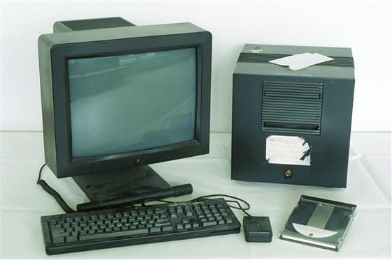
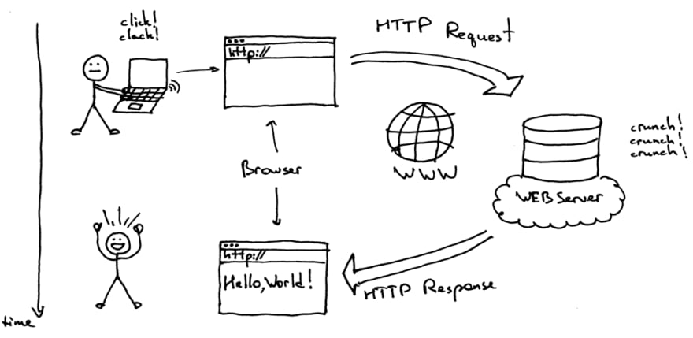
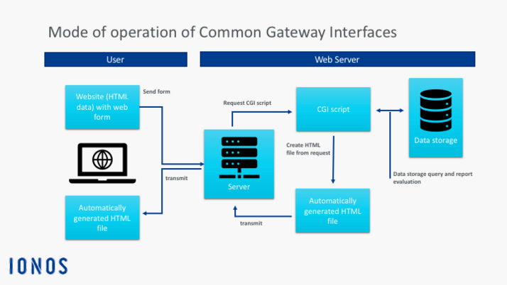
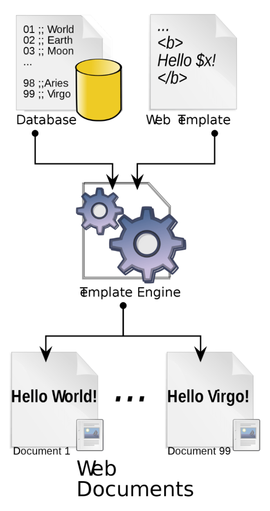

본 글은 [A "Brief" History of the Web](https://dev.to/snickdx/a-brief-history-of-the-web-9c3)의 내용을 번역했습니다.

## 📌 첫 웹 서버, 웹 브라우저, 웹 페이지

1990년 후반에 버너스리가 HTML로 작성된 세계 최초 웹페이지를 배포했습니다. 아래는 세계 최초 웹 서버입니다.

당시 웹 서버는 네트워크에 연결된 컴퓨터로, 웹 서버는 자신의 IP에 접근하는 브라우저에게 자신의 파일시스템 일부를 노출합니다. 그리고 웹 브라우저는 파일시스템에서 HTML로 작성된 문서를 다운받아서 보여줍니다. 이 당시에도 네트워크 프로토콜은 HTTP였습니다.

---

## 📌 Dynamic Web의 시작인 Common Gate Interface

당시에 조금 더 똑똑한 웹페이제 대한 요구가 있었습니다. 웹 서버도 똑같은 컴퓨터인데, 웹 서버라고 프로그램을 실행하지 못할 이유가 있나?라는 질문과 함께요. CGI는 웹 서버로 하여금 서버가 단순히 HTML 페이지를 반환하는 것이 아니라, 프로그램을 실행 가능케 만들었습니다. 초기 CGI는 C로 작성된 코드만을 실행하다가, 이후에 Perl, Ruby와 같은 다른 언어에 대한 실행도 가능해졌습니다.

[이미지 출처](https://www.ionos.co.uk/digitalguide/websites/web-development/what-is-a-cgi/)

---

## 📌 Templating

서버 사이드 스크립팅 이전에, 웹 사이트는 오직 읽기만 가능했습니다. 그리고 웹 페이지에 방문하면 작성자에 의해서 업데이트 되지 않는 이상 항상 같은 컨텐츠가 보여졌습니다. 또한, 하나의 웹 사이트에 유사한 스타일을 가진 페이지가 여러개 존재한다면, 어찌됐건 공유하는 스타일을 사용하는 것이 아닌, 각 페이지별로 스타일이 쓰여져 있어서 스타일이 업데이트되면 각 페이지를 업데이트 해주어야 했습니다.

Templating은 이 문제에 대한 해결책이 되었습니다. Templating을 통해서 페이지의 일부를 재사용하거나, for문이나 if문을 통한 HTML 코드 작성이 가능했습니다.

그리고 CGI Script는 Template Engine이 해석해주었습니다. Template Engine이 서버에서 브라우저로 html을 내려주기 전에, CGI Script를 해석하여 HTML에 대한 전처리를 진행했습니다.

서버에 실행 모델이 존재할 수 있게 되면서, 서버 사이드 스크립트를 데이터 베이스에 연결하여 Templating을 하므로써 웹 페이지는 조금 더 다이나믹 해질 수 있었습니다. 서버 사이드 스크립트가 데이터 베이스로부터 데이터를 가져와서 페이지에 데이터를 표현하기 위한 template 문법을 적용하는 것이지요. 이로 인해서 페이지의 수정 없이 데이터만 바꿈으로서 페이지가 조금 더 다이나믹 해지는 것입니다. 이것이 interactive web의 시작이었습니다.

---

## 📚 참고 문헌

[What is CGI?](https://www.ionos.co.uk/digitalguide/websites/web-development/what-is-a-cgi/)

