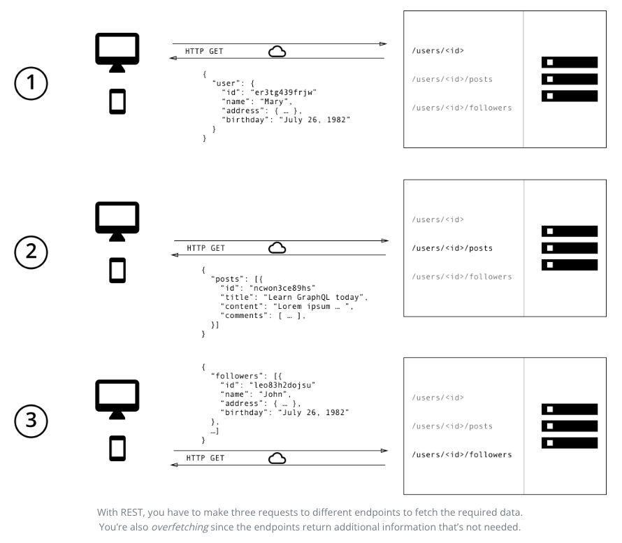
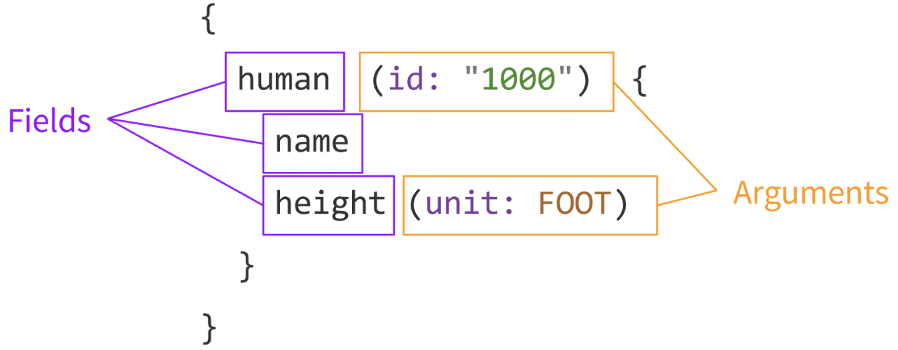

<!-- ---
date: '2022-10-16'
title: 'GraphQL introduction'
subTitle: 'GraphQL이란?'
grandParent: ''
parent: 'GraphQL'
slug: '/graphql/introduction'
---

본 글은 의 내용을 참고, 번역했습니다.

## 📌 GraphQL이란?

REST는 지난 10년간 웹 API 디자인의 표준으로 자리잡았고, stateless server나 structured access라는 좋은 아이디어도 제시했습니다. 하지만 REST API는 빠르게 변화하는 클라이언트 요구사항을 따라가기에는 유연성이 너무 부족한 문제가 있었습니다. graphQL은 유연성과 효율성을 제공하며 많은 개발자들이 REST API를 사용하면서 겪었던 문제를 해결해줍니다.

## 📌 GraphQL vs REST API

GraphQL과 REST API의 차이를 알아보기 위해서 한가지 상황을 예시로 들어보겠습니다. 어떤 애플리케이션의 화면에서 유저 프로필 및 특정 유저가 작성한 포스트들의 제목, 그리고 해당 유저의 팔로워 3명을 보여줍니다. 이 상황을 GraphQL과 REST는 어떻게 풀어나갈까요?

### 1. REST와 GraphQL의 데이터 fetch

REST API라면 데이터를 얻기 위해서 여러개의 endpoint에 접근할 것입니다. 처음에는 /users/:id endpoint에 접근하여 유저 데이터를 가져오고, 두번째는 /users/:id/posts endpoint에 접근해서 유저가 작성한 포스트 데이터를 가져오고, 마지막으로 /users/:id/followers endpoint에 접근해서 유저의 팔로워 데이터를 가져올 것입니다. 아래 그림처럼 말이죠.



하지만 GraphQL은 하나의 쿼리를 보내서 원하는 데이터를 모두 얻을 수 있습니다. 아래 그림처럼 말이죠


### 2. 과한 데이터 fetch와 덜한 data fetch

REST의 문제 중 하나는 과하거나 혹은 덜한 데이터 fetch를 한다는 점이다. 이는 endpoint로부터 받는 데이터의 구조가 고정되어 있어서 클라이언트가 필요한 정확한 데이터 구조를 제공하기 어렵다.

과한 데이터 fetch는 클라이언트가 필요 이상의 데이터를 받는다는 것이다. 예를들어 유저들의 이름을 리스트로 화면에 보여주려고 한다면 아마도 /users endpoint에 요청해야 할것이다. 그리고 여기에는 유저 이름뿐만 아니라, 생일, 주소 등의 당장 화면에 필요하지 않은 데이터도 들어있다.

덜한 데이터 fetch는 n + 1의 fetch가 발생하는 것이다. 이는 특정 endpoint가 원하는 데이터를 모두 제공하지 않는다는 점이다. 그래서 클라이언트는 원하는 데이터를 모두 얻기 위해서 추가적인 요청을 보낼수밖에 없다. 상황이 더 안좋아지면, 처음에 n개의 아이템을 포함하는 리스트 데이터를 요청하고, 각 리스트에 대해서 추가적인 데이터를 요청하는 경우, n + 1의 fetch가 발생할 수 있다.

### 3. frontend의 빠른 변화

REST API의 공통적인 패턴은 endpoint를 화면과 일치시켜서 구조화하는 것이다. 클라이언트 입장에서는 필요한 데이터를 얻기 위해서 화면에 매칭되는 endpoint에 접근하면 되는 장점이 있다.

하지만 문제는 frontend의 빠른 변화를 따라가지 못한다는 점이다. 만약 화면이 바뀐다면 화면에 요구되는 데이터가 더 많아지거나 혹은 더 적어질 확률이 높다. 결과적으로 이에 맞게 endpoint도 변경해야 하지만, 이는 생산성을 떨어뜨리고, 유저의 피드백 반영이 늦어지게 만든다.

하지만 GraphQL의 경우, 본질적인 유연성 덕분이 화면의 변화가 서버에 어떠한 작업도 요구하지 않는다. 클라이언트는 부가적인 데이터를 기술하면 될뿐이고, 백엔드 개발자는 어떠한 추가적인 대응도 할 필요가 없다.

### 4. 백엔드에 대한 통찰력 향상

GraphQL는 백엔드에 어떠한 데이터가 요청되는지 쉽게 알수 있습니다. 클라이언트는 화면에 필요한 정보를 정확하게 기술하기 떄문에, 이용 가능한 데이터는 무엇이고 어떻게 사용되는지에 대한 깊게 이해할 수 있습니다. 이는 어떠한 클라이언트에서도 요청되지 않는 데이터 필드를 제거하는데도 도움이 됩니다.

GraphQL과 함께라면 서버에서 가공되는 요청에 대해 저수준의 성능 모니터링도 가능합니다. 이는 클아이언트에 의해 요청된 데이터를 모으는 resolver functions를 통해서 가능한데, 이러한 resolver function들의 성능을 측정하면 시스템상에서 병목점에 대한 정보를 찾아낼 수 있다.

---

## 📌 GraphQL의 기본 개념

### 1. Field, Argument, Operation

field는 요청하는 데이터의 단위를 의미하며, 응답 JSON 객체의 각 field를 의미합니다. 그리고 argument는 특정 필드에 키와 값의 쌍을 부여함으로써 필드를 어떻게 가져올지에 대한 정보를 전달합니다.



위는 operation type과 operation name을 생략한 축약형 문법으로, 모호하지 않게 만들려면 아래와 같이 operation name과 operation type을 삽입해 주는 것이 좋습니다.


operation type에는 query, mutation, subscription이 존재하며, operation name은 명시적으로 적어줌으로써 디버깅이나 서버사이드 로깅시 도움이됩니다.

### 2. Query와 Mutation

GraphQL의 operation에는 query와 mutation 두가지가 존재합니다. query는 데이터를 가져오기 위해서 사용되고, mutation은 서버 데이터를 수정하기 위해서 사용됩니다. REST로 따진다면 query는 GET 메서드와 같고, mutation은 DELETE, PUT, PATCH와 같습니다.

query를 통해서 펫에 대한 정보를 가져올 때 다음과 같이 작성한다고 가정해봅시다.

```javascript
query GetAllPets {
  pets {
    name
    petType
  }
}
```

mutation을 통해서 새로운 펫을 추가하려고 한다면 다음과 같이 작성할 것입니다.

```javascript
mutation AddNewPost ($name: String!, $petType: PetType) {
  addPet(name: $name, petType: $petType) {
    id
    name
    petType
  }
}
```

그리고 다음 데이터를 mutation에 전달할 때

```javascript
{
  "name": "Rover",
  "petType": "DOG"
}
```

다음과 같은 응답을 받게될 것입니다.

```javascript
{
  "data": {
    "addPet": {
      "id": 1
      "name": "Rover",
      "petType": "DOG"
    }
  }
}
```

query와 mutation에는 두가지 차이점이 존재합니다. 첫번째는 operation type을 query와 mutation으로 구분한다는 것이고, 두번째는 mutation의 이름을 서버 GraphQL API의 이름과 동일하게 작성한다는 것입니다. 위 AddNewPet 예제에서 mutation의 이름은 addPet입니다. 이는 GraphQL API 타입 정의에 다음과 같은 필드가 존재한다는 것을 의미합니다.

```javascript
type Mutation {
  addPet (name: String!, petType: PetType): AddPetResult!
}
```

### 3. data graph

### 4. resolver

### 5. Schema와 Type System

GraphQL 서버는 스키마(Schema)를 이용해서 데이터 그래프의 모양을 묘사합니다. 스키마는 타입들의 계층을 서버가 제공하는 데이터 필드와 함께 정의합니다. 아래는 간단한 스키마 예제입니다.

```javascript
type Book = {
  title: String
  author: Author
}

type Author = {
  name: String
  books: [Book]
}
```

뿐만 아니라 스키마는 클라이언트가 데이터 그래프에 대해서 사용할 수 있는 queries와 mutations를 정의합니다.

---

## 📚 참고문헌

**[GraphQL is the better REST](https://www.howtographql.com/basics/1-graphql-is-the-better-rest/)**

**[GraphQL 공식문서](https://graphql.org/learn)**

https://graphql.org/learn/schema/#type-system

https://www.apollographql.com/blog/graphql/basics/the-anatomy-of-a-graphql-query/

https://docs.hypi.app/docs/lowcode/gql-schema-types/

**[GraphQL Mutation vs Query – When to use a GraphQL Mutation](https://www.apollographql.com/blog/graphql/basics/mutation-vs-query-when-to-use-graphql-mutation/)**
 -->

