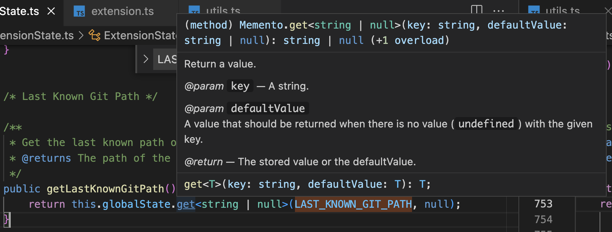

## 📌 git pull, fetch 차이

git rebase에 대해서 공부하던 중 git pull과 git fetch, git remote update의 차이점이 궁금해져서 [리서치](https://phoenixnap.com/kb/git-fetch)했다.

git pull은 git fetch와 git merge가 합쳐진 명령어다.

git fetch는 원격 브랜치의 변경 사항을 로컬의 .git 폴더(local repository)로 가져오지만, 로컬 브랜치의 코드(workspace)에 적용하지 않는다. 이를 통해서 원격 브랜치에서 가져온 변경 사항을 로컬 브랜치의 코드에 반영하기 전에 리뷰할 수 있는 기회가 생기고, merge로 인해서 발생하는 충돌을 막을 수도 있다. 그림으로 보면 아래와 같다.


[stackoverflow](https://stackoverflow.com/a/15990759/19204745)에서 설명하기로 git fetch를 이용하는 과정은 다음 cli들을 통해서 이루어진다.

```cmd
git fetch
git diff master origin/master
```

확인 및 수정이 끝났다면, git pull을 통해서 업데이트 가능하다.

---

## 📌 git switch, checkout 차이

pull, fetch, remote update의 차이에 이어서, checkout과 switch의 차이가 궁금해져서 추가적으로 리서치했다.

[stackoverflow](https://stackoverflow.com/questions/57265785/whats-the-difference-between-git-switch-and-git-checkout-branch)과 [stackoverflow](https://stackoverflow.com/questions/57265785/whats-the-difference-between-git-switch-and-git-checkout-branch)를 참고했다.

checkout는 switch와 restore라는 두가지 기능을 동시에 갖고 있다. 이는 사람들로 하여금 사용 목적에 많은 혼란을 일으켰는데, git 2.23에서부터 checkout이 갖고 있는 기능을 분리한 switch와 restore가 도입되었다.

[새 버전에 맞게 git checkout 대신 switch/restore 사용하기](https://blog.outsider.ne.kr/1505)에서는 아래와 같이 기능이 분리되었음을 설명한다.

- checkout: Switch branches or restore working tree files
- switch: Switch branches
- restore: Restore working tree files

checkout은 git checkout <filename>으로 사용하는 경우, unstaged의 변경 사항을 제거할 수 있다. 이는 git restore <filename>과 동일하다.

git checkout <branchname>으로 사용하는 경우, 해당 branchname으로 switch가 가능하다. 이는 git switch <branchname>과 동일하다.

---

## 📌 CI/CD, devOps 용어 살펴보기

이번에 오픈소스 기여를 하면서 pr에서 ci 에러와 마주쳤다. ci/cd 및 devOps에 대한 개념이 없고, 시간도 없던터라 러프하게 찾아보았다.

우선 [ci/cd](https://resources.github.com/ci-cd/)에서 ci는 빌드, 테스트, 통합의 과정이고, cd는 content delivery랑 content deployment로 나뉠 수 있는데, 전자는 배포전에 중단될 수 있는 여지가 있으며, 후자는 배포까지 중단없이 이어진다고 한다.

[devOps](https://www.netapp.com/ko/devops-solutions/what-is-devops/)는, dev(개발)과 ops(운영)간의 원활한 커뮤니케이션 및 협업을 장려하여 애플리케이션 개발의 품질과 속도를 향상시키고, 제품의 릴리즈 주기를 단축시킴으로서 고객 만족을 향상시킨다고 한다. 지금까지 한번쯤 들어보고, 또 행해본 스크럼, 칸반, 애자일 모두 DevOps 방법들이고, jira, github, slack이 모두 DevOps 툴체인의 일부라고.

---

## 📌 코드 리펙토링을 진행하면서

코드 리펙토링을 진행하면서 두가지 리펙토링을 진행했다.

첫번째로는 다음과 같은 유형의 코드다.

```javascript
const targetData = getTargetData()
otherFunction(targetData)
```

함수 이름에 이미 목적어가 있는데 굳이 식별자를 한번 거쳐서 전달하고 있었다. 그래서 다음과 같이 리펙토링했다.

```javascript
otherFunction(getTargetData())
```

리펙토링을 하며 유인동 저자의 '함수혐 자바스크립트 프로그래밍'책을 다시금 펴볼 기회가 생겼다.

> 값 대신 함수로, for와 if 대신 고차 함수와 보조 함수로, 연산자 대신 함수로, 함수 합성 등 앞서 설명한 함수적 기법들을 사용하면 코드도 간결해지고 함수명을 통해 로직을 더 명확히 전달할 수 있어 읽기 좋은 코드가 된다. 짧고 읽기 좋은 코드도 중요한 가치이지만 좀 더 고상한 이점이 있다. 인자 선언이나 변수 선언이 적어진다는 점이다. 코드에 인자와 변수가 등장하지 않고 함수의 내부가 보이지 않는다는 것은 새로운 상황도 생기지 않는다는 말이다. 새로운 상황이 생기지 않는다는 것은 개발자가 예측하지 못할 상황이 없다는 말이다.

두번째로는 커스텀 훅에서 리턴해주는 함수에 대한 이야기이다. 개인 취향 및 컨벤션 차이가 있는 부분이다.

개인적으로 이벤트 핸들러 함수 이름을 handle + 동사 + 목적어로 짓는데, 커스텀 훅에서 만약 이벤트 핸들러의 역할을 할수 있는 함수를 반환한다면, handle 접두사 없이 곧바로 동사로 시작하도록 변경했다.

개인 취향 및 컨벤션 차이일수도 있는데, 개인적으로 훅이 이벤트 핸들러 안에서 다른 여러 로직과 함께 실행되는 경우를 많이 마주쳤다. 그래서 다음과 같이 이벤트 핸들러 함수 안에 handle이 하나 더 추가되는 것이 어색하다고 느껴졌다.

```javascript
const ComponentFunction = () => {
  const [handleChangeButtonDisplay] = useBtnDisplay()

  const handleClickBtn = () => {
    handleChangeButtonDisplay()
    fn1()
    fn2()
  }

  return <Button onClick={handleClickBtn}>ButtonName</Button>
}
```

다음과 같이 바꾸는 편이 좀 더 깔끔해 보인다.

```typescript
const ComponentFunction = () => {
  const [changeBtnDisplay] = useBtnDisplay()

  const handleClickBtn = () => {
    changeBtnDisplay()
    fn1()
    fn2()
  }

  return <Button onClick={handleClickBtn}>ButtonName</Button>
}
```

---

## 📌 isNil 함수 수정하기

8월 4일에 isNil 함수를 다음과 같이 작성했었다.

```typescript
const isNil = <T>(param: T | Nil): param is T =>
  param !== undefined || param !== null
```

isNil(value)의 결과가 undefined임에도 불구하고 if문을 통과하는 것을 보고, 문제점을 발견하여 수정했다.

```typescript
const isNil = <T>(param: T | Nil): param is T =>
  parm !== undefined && param !== null
```

---

## 📌 expand와 collapse 역할을 하는 버튼의 이름을 무엇일까

아래와 같이 collapse와 expand의 역할을 하는 버튼을 만들어야 할 일이 있었다. 버튼 요소 안에서 collapse와 expand 아이콘을 분기하는 로직을 짜는데, 이 버튼의 이름을 무엇으로 만들어야 할지 고민이었다.

```javascript
const ComponentFunction = () => {
  return <Button>{isExpanded ? <ExpandIcon /> : <CollapseIcon />}</Button>
```

[마이크로소프트의 윈도우 디자인 가이드]()에서는 이를 Expander로 지어, 이를 따르기로 결정했다.

---

## 📌 Git Graph 소스코드를 뜯어보며

[githru](https://github.com/githru/githru-vscode-ext) 오픈소스를 기여하면서, 파일을 클릭했을 때 해당 파일의 commit diff를 보여주는 기능을 구현하려 했다. commit diff에 대한 api 키워드가 잡히지 않아서 [Git Graph 소스코드](https://github.com/mhutchie/vscode-git-graph)를 참고하려고 했는데, 아래와 같은 구조의 함수를 마주쳤다.



이전에 데브코스를 수강할 때 강사님께서 localStorage.getItem(key)를 래핑하여 localStorage.getItem(key, defaultValue)와 같이 사용 가능하도록 함수를 사용한적이 있는데, vscode api는 기본적으로 이 기능이 내장되어 있었다. 과거에 아무 생각 없이 썼던 함수, 약간 레퍼런스 없는 함수를 이렇게 api로 제공하고 있는 것을 보고 재미(?)를 느꼈다. 마땅한 표현이 떠오르지 않는데, 점과 점을 잇는데 기분이 좋은?

---

## 📌 금주 읽은 문서

회사에서 내가 담당하는 페이지중 하나가 (개인적으로) 난이도가 매우 높다. 그리고 일전에 [React 상태 관리 라이브러리(1)](https://blog-wherehows.vercel.app/study/react-state-management-1)를 작성하면서 상태가 복잡한 경우 state machine을 사용하라는 것에 대한 글귀를 본 기억이 있어서, 이 페이지의 복잡성을 해소시켜줄 열쇠가 될수도 있을 것 같아서 찾아보았다.

[State Machines in React](https://mastery.games/post/state-machines-in-react/)

[How to Use Finite State Machines in React](https://www.telerik.com/blogs/how-to-use-finite-state-machines-react)

이번주에는 로버트 C. 마틴의 클린 아키텍처 책에서 파서드 패턴이 언급되어 관련한 문서를 찾아보았다.

[Facade Design Pattern](https://refactoring.guru/design-patterns/facade)

[Facade Design Pattern 2](https://www.patterns.dev/posts/classic-design-patterns/#facadepatternjavascript)

[Facade Design Pattern 3](https://sbcode.net/typescript/)

