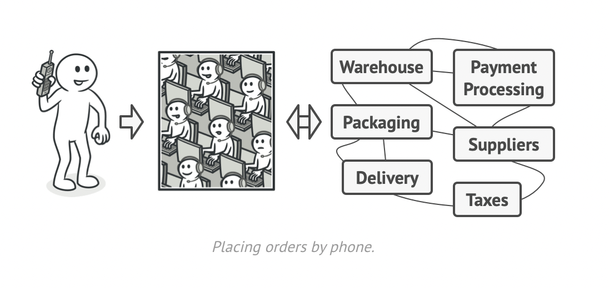

본 글은 [refactoring.guru](https://refactoring.guru/), [Design Patterns In Typescript](https://sbcode.net/typescript/), [Learning JavaScript Design Patterns](https://www.patterns.dev/posts/classic-design-patterns/)의 내용을 참고, 번역했습니다.

## 📌 Facade Pattern

structural pattern에 속하며, 라이브러리나 프레임워크에 대한 간단하고 편리한 인터페이스를 제공합니다.

### --- Problem and Solution

매우 복잡한 SubSystem(라이브러리나 프레임워크)에 속한 광범위한 객체 집합들과 함께 동작해야하는 코드를 작성한다고 상상해보세요. 보통 이러한 객체들은 초기 내용을 설정하고, 의존성을 추적하고, 올바른 순서대로 메서드가 실행돼도록 해야합니다. 결과적으로는 당신의 클래스 내 비지니스 로직들이 라이브러리 클래스의 구현 내용들과 강하게 결합되면서 이해하기 어렵고 유지보수하기 힘든 코드가 만들어지게 됩니다.

Facade는 SubSystem이 갖고 있는 수많은 기능을 제공하는 것이 아니라 몇몇의 기능만 제공하며, 복잡한 SubSystem 대한 간단한 인터페이스를 제공하는 클래스입니다.

현실 세계에서 전화 주문을 생각하면 쉽습니다. 주문을 위해서는 주문, 지불, 배달에 대한 과정을 직접 밟아야 하지만, 전화 상담원을 통해서 이러한 과정을 쉽게 처리할 수 있습니다.



### --- Pros and Cons

복잡한 하위 시스템의 코드를 분리할 수 있다는 장점이 있지만, god object가 될수도 있다는 단점도 존재합니다.

### --- Code

```typescript
class SubSystemA {
  // 내부가 매우 복잡하다고 가정한다.
  method() {
    return 1
  }
}

class SubSystemB {
  // 내부가 매우 복잡하다고 가정한다.
  method(value) {
    return value
  }
}

class SubSystemC {
  // 내부가 매우 복잡하다고 가정한다.
  method(value) {
    return value + 2
  }
}

class Facade {
  subSystemClassA() {
    return new SubSystemClassA().method()
  }

  subSystemClassB(value) {
    return new SubSystemClassB().method(value)
  }

  subSystemClassC(value) {
    return new SubSystemClassC().method(value)
  }

  operation(valueB, valueC) {
    return (
      subSystemClassA().method() +
      subSystemClassB().method(valueB) +
      subSystemClassC().method(valueC)
    )
  }
}

// 하위 시스템을 다이렉트로 사용하는 경우
console.log(
  new SubSystemClassA().method() +
    new SubSystemClassB().method(2) +
    new SubSystemClassC().method(3),
) // 8

// 간단한 Facade를 통해서 하위 시스템을 사용하는 경우
const facade = new Facade()
console.log(facade.operation(2, 3)) // 8
```

